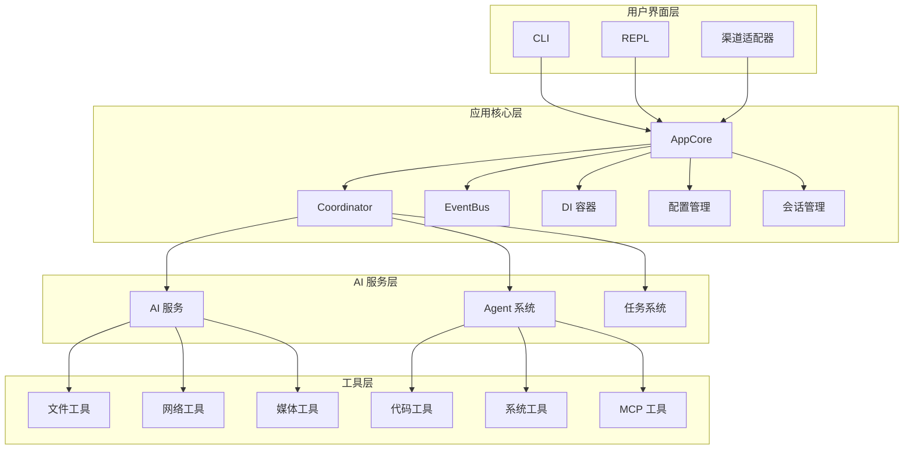
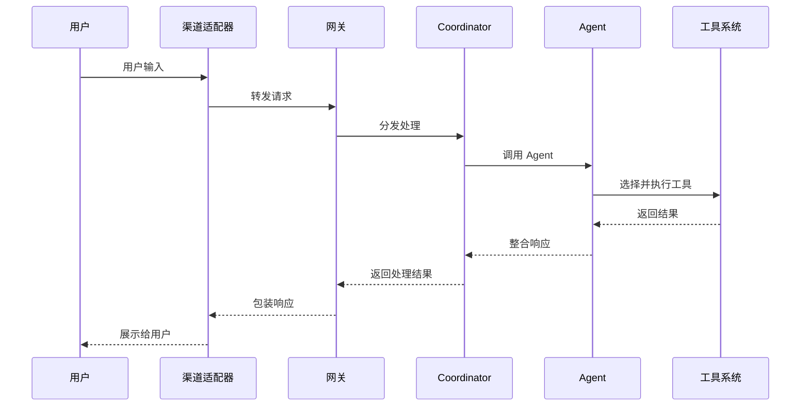

# 系统架构

## 整体架构

## 架构原则

### 模块化

所有功能以模块形式组织，通过依赖注入容器管理：

- 模块间通过接口通信
- 依赖显式声明
- 支持模块热替换

### 事件驱动

使用事件总线进行模块间通信：

- 解耦消息发送者和接收者
- 支持异步处理
- 可扩展的监听器链

### 安全优先

多层次安全控制：

- 治理策略控制工具权限
- 沙箱隔离执行环境
- 审计日志记录所有操作
- 内容安全过滤

## 数据流

