# 模块依赖关系验证报告

## 验证结果
- **状态**: ✅ 通过
- **错误数量**: 0
- **警告数量**: 0
- **循环依赖**: 0
- **缺失依赖**: 0

## 依赖关系图

```mermaid
graph TD
  core --> infrastructure
  core --> ai
  infrastructure --> ai
  error --> ai
  core --> agent
  ai --> agent
  error --> agent
  core --> bridge
  infrastructure --> bridge
  oauth --> bridge
  error --> bridge
  core --> ui
  infrastructure --> ui
  core --> cli
  infrastructure --> cli
  core --> tools
  infrastructure --> tools
  error --> tools
  core --> commands
  cli --> commands
  core --> memory
  infrastructure --> memory
  error --> memory
  core --> cache
  infrastructure --> cache
  core --> security
  infrastructure --> security
  error --> security
  core --> oauth
  infrastructure --> oauth
  config --> oauth
  core --> permission
  security --> permission
  core --> performance
  infrastructure --> performance
  error --> performance
  core --> monitoring
  infrastructure --> monitoring
  error --> monitoring
  core --> featureflags
  infrastructure --> featureflags
  core --> analytics
  infrastructure --> analytics
  core --> buddy
  ui --> buddy
  core --> chat
  ai --> chat
  error --> chat
  core --> chronos
  infrastructure --> chronos
  core --> config
  infrastructure --> config
  core --> context
  infrastructure --> context
  core --> cost
  infrastructure --> cost
  core --> docs
  infrastructure --> docs
  core --> error
  core --> hooks
  infrastructure --> hooks
  core --> lsp
  infrastructure --> lsp
  core --> mcp
  infrastructure --> mcp
  featureflags --> mcp
  oauth --> mcp
  core --> plugins
  infrastructure --> plugins
  core --> query
  infrastructure --> query
  core --> sandbox
  security --> sandbox
  featureflags --> sandbox
  core --> services
  infrastructure --> services
  core --> streaming
  infrastructure --> streaming
  services --> streaming
  core --> utils
  infrastructure --> utils
  core --> keybindings
  infrastructure --> keybindings
```

## 拓扑排序（初始化顺序）
agent → bridge → tools → commands → memory → cache → permission → performance → monitoring → analytics → buddy → chat → chronos → context → cost → docs → hooks → lsp → mcp → plugins → query → sandbox → streaming → utils → keybindings → cli → ui → ai → oauth → security → featureflags → services → config → error → infrastructure → core

## 模块统计
- **总模块数**: 36
- **模块分类**:
  - core: 1
  - infrastructure: 2
  - ai: 1
  - agent: 1
  - bridge: 1
  - ui: 1
  - cli: 1
  - tools: 1
  - commands: 1
  - memory: 1
  - cache: 1
  - security: 4
  - performance: 1
  - monitoring: 1
  - other: 18
