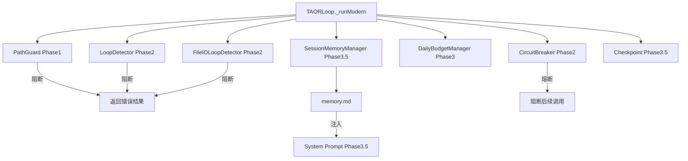

# Loop 模块优化完善方案

> 基于 [loop-benchmark-analysis-20260714.md](file:///E:/PY/CODES/PY_APP/dev_docs/20260714/loop-benchmark-analysis-20260714.md) 对标分析结果
> 日期：2026-07-14 | 版本：v2.2
> v2.2 更新：Liri 4th review 整改（检测器优先级矩阵、createHash import、compactMemory 实现细节、工具常量提炼、Phase 间变更通知等 10 项）

---

## 一、方案总览

### 1.1 优化目标

| 阶段 | 时间 | 目标 | 改动量 |
|------|------|------|:---:|
| Phase 1: 安全加固 | 本周 | 类型绕过消除、单次压缩守卫、路径拒绝 (PathGuard) | 中（4 文件） |
| Phase 2: 检测增强 | 下周 | 补齐循环检测短板 + 测试 | 中（4 文件） |
| Phase 3: 预算优化 | 两周内 | 收益递减、优雅最后一调、废弃代码标记 | 中（3 文件） |
| Phase 3.5: 记忆保持 | 两周内 | Compact 保留 20 轮、逐轮提取、检查点启用、分层记忆注入 | 中（4 文件） |
| Phase 4: 架构演进 | 远期 | 制造者/检查者分离、文档、流式工具执行 | 大（规划期） |

### 1.2 设计原则

- **外科手术式修改**：只改必须改的，不碰无关代码
- **新增前归一化检查**（CS01）：所有新增代码先查已有实现
- **回退最小化**（CS03）：不加"以防万一"的代码
- **Mock 零容忍**（CS04）：测试用真实逻辑，不用假数据

---

## 二、Phase 1：安全加固（本周，预计 4-6h）

### 2.1 消除 `as unknown as TAORLoopDeps` 类型绕过

**文件**：`app/src/query/ChatManagerTAORAdapter.ts`（第 176 行）

**问题**：`as unknown as TAORLoopDeps` 绕过了品牌类型（brand type）检查，编译期无法捕获接口不匹配。

**方案**：将 `TAORLoopDeps` 的 `[TAOR_LOOP_DEPS_BRAND]` 品牌符号改为可赋值模拟值，移除强制转换。

**修改步骤**：

1. 在 `TAORLoop.ts` 中新增工厂函数 `createTAORLoopDeps`，接受一个普通对象并返回带品牌的 `TAORLoopDeps`：

```typescript
// TAORLoop.ts 新增
const TAOR_LOOP_DEPS_BRAND_VALUE = Symbol('TAORLoopDeps') as unknown as typeof TAOR_LOOP_DEPS_BRAND;

/**
 * 工厂函数：创建 TAORLoopDeps
 * 替代 as unknown as TAORLoopDeps 绕过，提供类型安全的构造方式
 */
export function createTAORLoopDeps(impl: Omit<TAORLoopDeps, typeof TAOR_LOOP_DEPS_BRAND>): TAORLoopDeps {
  return { ...impl, [TAOR_LOOP_DEPS_BRAND]: TAOR_LOOP_DEPS_BRAND_VALUE } as TAORLoopDeps;
}
```

2. 修改 `ChatManagerTAORAdapter.ts` 第 176 行：

```typescript
// 旧代码（第 69-176 行）
export function createChatManagerTAORDeps(ctx: ChatManagerTAORContext): TAORLoopDeps {
  return { ... } as unknown as TAORLoopDeps;
}

// 新代码
import { createTAORLoopDeps } from './TAORLoop.js';

export function createChatManagerTAORDeps(ctx: ChatManagerTAORContext): TAORLoopDeps {
  return createTAORLoopDeps({ ... });
}
```

3. 同步更新 `LongRunningTaskOrchestrator.ts` 中的同类型绕过。

4. `index.ts` 新增导出：

```typescript
export { createTAORLoopDeps } from './TAORLoop.js';
```

**验证**：`bun run typecheck` 通过，无新增 type error。

---

### 2.2 新增单次尝试守卫（防止压缩-重试死循环）

**对标**：cc_code `hasAttemptiveReactiveCompact`

**文件**：`app/src/query/ErrorRecoveryManager.ts`

**新增逻辑**：在 `ErrorRecoveryManager` 中新增 `_compactAttempted: boolean` 字段，`context_overflow` 恢复仅允许一次压缩尝试。

**修改**：

```typescript
// ErrorRecoveryManager.ts 新增字段与方法

export class ErrorRecoveryManager {
  private attempts: Map<RecoveryType, RecoveryAttempt> = new Map();
  private _compactAttempted: boolean = false; // ← 新增

  /**
   * 评估错误并返回恢复策略
   */
  assess(error: Error, context: RecoveryContext): RecoveryResult {
    const type = classifyError(error);

    if (!type) {
      return { recovered: false, action: 'abort' };
    }

    const attempt = this.attempts.get(type);
    if (!attempt) {
      return { recovered: false, action: 'abort' };
    }

    // 单次尝试守卫：压缩只能尝试一次
    if (type === 'context_overflow' && this._compactAttempted) {
      return {
        recovered: false,
        action: 'abort',
        message: '上下文压缩已尝试过，放弃重试（防止压缩-重试死循环）',
      };
    }

    attempt.lastError = error;
    attempt.retryCount++;

    if (attempt.retryCount > attempt.maxRetries) {
      return {
        recovered: false,
        action: 'abort',
        message: `恢复尝试已超过最大次数 (${attempt.maxRetries})`,
      };
    }

    switch (type) {
      case 'context_overflow':
        this._compactAttempted = true; // ← 标记压缩已尝试
        return {
          recovered: true,
          action: 'compact_and_retry',
          message: '上下文溢出，压缩后重试',
        };
      // ... 其余不变
    }
  }

  /**
   * 重置所有重试计数（新一轮对话开始时调用）
   */
  resetAll(): void {
    for (const attempt of this.attempts.values()) {
      attempt.retryCount = 0;
      attempt.lastError = undefined;
    }
    this._compactAttempted = false; // ← 新增重置
  }

  /**
   * 序列化恢复状态（用于 Checkpoint 持久化）
   */
  serialize(): RecoveryState {
    const entries: Array<[string, { type: RecoveryType; retryCount: number }]> = [];
    for (const [key, attempt] of this.attempts) {
      entries.push([key, { type: attempt.type, retryCount: attempt.retryCount }]);
    }
    return { attempts: entries, compactAttempted: this._compactAttempted };
  }

  /**
   * 从序列化状态恢复
   */
  restore(state: RecoveryState): void {
    this.attempts = new Map();
    for (const [key, data] of state.attempts) {
      this.attempts.set(key as RecoveryType, {
        type: data.type,
        maxRetries: DEFAULT_MAX_RETRIES[data.type] ?? 3,
        retryCount: data.retryCount,
      });
    }
    this._compactAttempted = state.compactAttempted ?? false;
  }
}
```

同步更新 `RecoveryState` 接口：

```typescript
interface RecoveryState {
  attempts: Array<[string, { type: RecoveryType; retryCount: number }]>;
  compactAttempted?: boolean; // ← 新增
}
```

---

### 2.3 新增路径拒绝列表

**对标**：loop-engineering `loop-constraints.md`（`.env`、`auth/`、`payments/`、`secrets/`）

**新增文件**：`app/src/query/PathGuard.ts`

**设计**：在 Loop 启动时检查工具调用目标路径是否命中拒绝列表，命中则直接拒绝执行。

```typescript
// app/src/query/PathGuard.ts（新文件）
// v2.2: import micromatch，替换手写正则（完整 glob 语法支持）
import { micromatch } from 'micromatch';
import { Logger } from '@modules/monitoring';

const logger = new Logger({ module: 'query:pathGuard' });

/**
 * PathGuard — 路径安全守卫
 *
 * Phase 1 新增。对标 loop-engineering 的路径拒绝列表机制。
 * 防止 Agent 循环触碰敏感文件路径（.env、auth/、payments/、secrets/ 等）。
 *
 * 配置来源：
 *   - 默认拒绝列表（内置）
 *   - 环境变量 LOOP_PATH_DENY_LIST（JSON 数组，追加到默认列表）
 */

/** 默认拒绝的路径模式（glob） */
const DEFAULT_DENY_PATTERNS: string[] = [
  '**/.env',
  '**/.env.*',
  '**/auth/**',
  '**/payments/**',
  '**/secrets/**',
  '**/credentials/**',
  '**/*.pem',
  '**/*.key',
  '**/id_rsa*',
];

/** 默认拒绝的写入路径（更严格） */
const DEFAULT_DENY_WRITE_PATTERNS: string[] = [
  ...DEFAULT_DENY_PATTERNS,
  '**/package-lock.json',
  '**/yarn.lock',
  '**/pnpm-lock.yaml',
  '**/bun.lockb',
  '**/Cargo.lock',
];

interface PathGuardConfig {
  /** 只读操作拒绝的路径模式 */
  denyRead: string[];
  /** 写入操作拒绝的路径模式（继承 denyRead） */
  denyWrite: string[];
}

interface PathCheckResult {
  allowed: boolean;
  reason?: string;
}

/** 加载环境变量追加配置 */
function loadEnvDenyPatterns(): string[] {
  try {
    const raw = process.env.LOOP_PATH_DENY_LIST;
    if (!raw) return [];
    const parsed = JSON.parse(raw);
    if (!Array.isArray(parsed)) return [];
    return parsed.filter((p): p is string => typeof p === 'string');
  } catch {
    return [];
  }
}

export class PathGuard {
  private config: PathGuardConfig;

  constructor() {
    const envPatterns = loadEnvDenyPatterns();

    this.config = {
      denyRead: [...DEFAULT_DENY_PATTERNS, ...envPatterns],
      denyWrite: [...DEFAULT_DENY_WRITE_PATTERNS, ...envPatterns],
    };
  }

  /**
   * 检查读取操作的目标路径是否允许
   */
  checkRead(targetPath: string): PathCheckResult {
    return this._check(targetPath, this.config.denyRead, 'read');
  }

  /**
   * 检查写入操作的目标路径是否允许
   */
  checkWrite(targetPath: string): PathCheckResult {
    return this._check(targetPath, this.config.denyWrite, 'write');
  }

  /**
   * 检查工具调用是否允许（根据 toolName 判断读/写）
   */
  checkToolCall(toolName: string, args: Record<string, unknown>): PathCheckResult {
    const path = this._extractPath(toolName, args);
    if (!path) return { allowed: true }; // 没有路径参数，放行

    const isWrite = this._isWriteTool(toolName);
    return isWrite ? this.checkWrite(path) : this.checkRead(path);
  }

  /**
   * 归一化路径后做 glob 匹配
   */
  private _check(targetPath: string, patterns: string[], operation: string): PathCheckResult {
    const normalized = targetPath.replace(/\\/g, '/').toLowerCase();

    for (const pattern of patterns) {
      if (this._matchGlob(normalized, pattern)) {
        return {
          allowed: false,
          reason: `路径 "${targetPath}" 命中拒绝列表 (${operation}: ${pattern})`,
        };
      }
    }

    return { allowed: true };
  }

  /**
   * 从工具调用 args 中提取路径参数
   */
  private _extractPath(toolName: string, args: Record<string, unknown>): string | null {
    // 读文件类工具
    if (['read_file', 'read', 'cat'].includes(toolName)) {
      return typeof args.path === 'string' ? args.path
        : typeof args.filePath === 'string' ? args.filePath
        : null;
    }
    // 写文件类工具
    if (['write_file', 'write', 'edit_file', 'replace_in_file'].includes(toolName)) {
      return typeof args.path === 'string' ? args.path
        : typeof args.filePath === 'string' ? args.filePath
        : null;
    }
    // 搜索/glob 类
    // v2.2: 参数名需与工具注册表定义对齐。实施时应在工具注册表中查找实际参数名。
    //   glob 通常用 `directory`/`pattern`，grep 用 `path`/`searchPath`。
    //   建议：从 tool.register 中读取参数定义，而非硬编码参数名列表。
    if (['glob', 'grep', 'search_files', 'search_content'].includes(toolName)) {
      return typeof args.path === 'string' ? args.path
        : typeof args.directory === 'string' ? args.directory
        : typeof args.searchPath === 'string' ? args.searchPath       // v2.2 grep
        : typeof args.target_directory === 'string' ? args.target_directory
        : null;
    }
    return null;
  }

  /**
   * 判断是否写操作工具
   */
  private _isWriteTool(toolName: string): boolean {
    // v2.0: bash/execute_command 从写工具列表中移除——
    //   命令执行（编译、测试、git）不一定写文件，误归为写操作会导致
    //   对命令路径的 glob 误匹配而拦截正常操作。
    //   对命令工具的敏感路径检测走 _extractPath 的读写路径逻辑。
    const writeTools = [
      'write_file', 'write', 'edit_file', 'replace_in_file',
      'create_file', 'delete_file', 'delete_files',
    ];
    return writeTools.includes(toolName);
  }

  /**
   * glob 匹配（使用 micromatch，支持 ** / ? / {a,b} 等全部标准 glob 语法）
   *
   * 手写正则方案不支持 ? 通配符和 {a,b} 模式，且 + $ ^ 等元字符转义不完整。
   * micromatch 是本项目已使用的依赖，无额外成本。
   */
  private _matchGlob(path: string, pattern: string): boolean {
    return micromatch.isMatch(path.toLowerCase(), pattern.toLowerCase());
  }
}

/** 工厂函数 */
export function createPathGuard(): PathGuard {
  return new PathGuard();
}
```

**集成点**：在 `TAORLoop.ts` 的 `_runModern()` 中，工具执行前调用 `pathGuard.checkToolCall()`：

```typescript
// TAORLoop.ts _runModern() 中工具执行处新增
import { createPathGuard } from './PathGuard.js';

// constructor 中初始化
this.pathGuard = createPathGuard();

// 工具执行前检查
for (const tc of toolCallsToExecute) {
  const pathCheck = this.pathGuard.checkToolCall(tc.name, tc.arguments);
  if (!pathCheck.allowed) {
    this.logger.warn('路径守卫拦截工具调用', {
      tool: tc.name,
      path: tc.arguments,
      reason: pathCheck.reason,
    });
    results.push({
      toolCallId: tc.id,
      toolName: tc.name,
      error: `[PATH_GUARD] ${pathCheck.reason}`,
    });
    continue;
  }
  // ... 继续执行工具
}
```

**验证**：`bun run typecheck` 通过。

---

### 2.4 Phase 1 验证清单

- [x] `bun run typecheck` 零错误
- [x] ChatManagerTAORAdapter 不再使用 `as unknown as`
- [x] 压缩重试超过 1 次后直接 abort（不再死循环）
- [x] 读取 `.env` 文件被 PathGuard 拒绝
- [x] 写入 `auth/` 目录被 PathGuard 拒绝
- [x] 环境变量 `LOOP_PATH_DENY_LIST` 可追加自定义规则

---

## 三、Phase 2：检测增强（下周，预计 8-12h）

### 3.1 新增 `unknown_tool_repeat` 循环检测器

**对标**：openclaw `tool-loop-detection.ts` 的 `unknown_tool_repeat` 检测

**文件**：`app/src/query/LoopDetector.ts`（修改现有文件）

**新增逻辑**：在 `LoopDetector` 中新增 `unknown_tool_repeat` 检测器。跟踪对不存在工具的调用，当同一不存在的工具连续被调用超过阈值时阻断。

**修改**：

1. 更新 `DetectorKind` 类型：

```typescript
type DetectorKind = 'generic_repeat' | 'ping_pong' | 'unknown_tool_repeat';
```

2. 新增 `unknown_tool_repeat` 配置：

```typescript
interface LoopDetectorConfig {
  // ... 现有字段
  detectors: {
    genericRepeat: boolean;
    pingPong: boolean;
    unknownToolRepeat: boolean; // ← 新增
  };
  /** 未知工具警告阈值，默认 5 */
  unknownToolWarningThreshold: number; // ← 新增
  /** 未知工具阻断阈值，默认 10 */
  unknownToolCriticalThreshold: number; // ← 新增
}

const DEFAULT_CONFIG: LoopDetectorConfig = {
  // ... 现有字段
  detectors: {
    genericRepeat: true,
    pingPong: true,
    unknownToolRepeat: true, // ← 新增
  },
  unknownToolWarningThreshold: 5,
  unknownToolCriticalThreshold: 10,
};
```

3. `ToolCallRecord` 新增字段：

```typescript
interface ToolCallRecord {
  // ... 现有字段
  /** 工具是否存在（false = 模型调用了不存在的工具） */
  toolExists?: boolean; // ← 新增
}
```

4. 新增 `recordUnknownTool()` 方法：

```typescript
/**
 * 记录模型调用了不存在的工具（工具注册表中未找到）
 * 这通常是模型幻觉或循环退化的信号
 */
recordUnknownTool(toolName: string, params: unknown): void {
  if (!this.config.enabled) return;

  const argsHash = hashToolCall(toolName, params, this.config.hashMaxInputLength);

  this.history.push({
    toolName,
    argsHash,
    timestamp: Date.now(),
    toolExists: false,
  });

  while (this.history.length > this.config.historySize) {
    this.history.shift();
  }
}
```

5. 在 `detect()` 方法中新增检测：

```typescript
detect(toolName: string, params: unknown): LoopDetectionResult {
  // ... 现有预检逻辑

  // 0. Unknown Tool Repeat Detection（优先级最高）
  if (this.config.detectors.unknownToolRepeat) {
    const result = this._detectUnknownToolRepeat(toolName);
    if (result.stuck) return result;
  }

  // 1. Generic Repeat Detection
  // ...

  // 2. Ping-Pong Detection
  // ...
}
```

6. 新增 `_detectUnknownToolRepeat()` 方法：

```typescript
/**
 * 未知工具重复检测：对不存在的工具连续调用
 * 模型反复调用同一个不存在的工具 → 无限死循环信号
 */
private _detectUnknownToolRepeat(toolName: string): LoopDetectionResult {
  // 只检测标记为 toolExists=false 的记录
  let count = 0;
  const unknownOnly = this.history.filter(
    (h) => h.toolName === toolName && h.toolExists === false
  );

  // 从尾部统计连续（仅统计 toolExists === false 的连续段）
  //   修正原逻辑：之前 toolExists === true 的同名记录不 break，
  //   会导致真实存在的工具的调用被误计入"未知工具重复"。
  for (let i = this.history.length - 1; i >= 0; i--) {
    const record = this.history[i];
    if (record.toolName === toolName && record.toolExists === false) {
      count++;
    } else {
      break; // 任何打断（不同工具名 / 同工具但存在）都停止
    }
  }

  if (count >= this.config.unknownToolCriticalThreshold) {
    return {
      stuck: true,
      level: 'critical',
      detector: 'unknown_tool_repeat',
      count,
      message: `工具 "${toolName}" 不存在，但被连续调用 ${count} 次（临界阈值 ${this.config.unknownToolCriticalThreshold}），已阻断`,
    };
  }

  if (count >= this.config.unknownToolWarningThreshold) {
    return {
      stuck: true,
      level: 'warning',
      detector: 'unknown_tool_repeat',
      count,
      message: `工具 "${toolName}" 不存在，连续调用 ${count} 次（警告阈值 ${this.config.unknownToolWarningThreshold}）`,
    };
  }

  return { stuck: false };
}
```

**集成点**：在 `TAORLoop.ts` 的 `_runModern()` 中，工具执行前调用 `loopDetector.recordToolCall()` 时，如果工具在注册表中找不到则调用 `recordUnknownTool()` 而非 `recordToolCall()`。

**验证**：新增单元测试，覆盖 unknown_tool_repeat 的 warning/critical 阈值。

**补充：`unknown_tool_aggregate` 聚合检测（v2.0 新增）**

单工具重复检测遗漏「交替假工具」场景——模型交替调用 3 个不同的假工具，每个单独不超阈值但整体呈幻觉退化。

```typescript
// LoopDetector 新增检测器类型
type DetectorKind = 'generic_repeat' | 'ping_pong' | 'unknown_tool_repeat' | 'unknown_tool_aggregate';

// 新增配置
interface LoopDetectorConfig {
  detectors: {
    genericRepeat: boolean;
    pingPong: boolean;
    unknownToolRepeat: boolean;
    unknownToolAggregate: boolean; // ← v2.0 新增
  };
  /** 聚合检测窗口大小，默认 20 */
  unknownToolAggregateWindow: number; // ← v2.0 新增
  /** 聚合比例阈值，默认 0.5（50%） */
  unknownToolAggregateRatio: number; // ← v2.0 新增
}

// detect() 中新增检测
if (this.config.detectors.unknownToolAggregate) {
  const aggResult = this._detectUnknownToolAggregate();
  if (aggResult.stuck) return aggResult;
}

/**
 * 未知工具聚合检测（v2.0 新增）
 * 统计最近 N 轮中不存在的工具占总调用比例，超过阈值触发阻断。
 * 解决「交替假工具」死循环问题——3 个假工具交替调用，单个不超阈值。
 */
private _detectUnknownToolAggregate(): LoopDetectionResult {
  const recent = this.history.slice(-this.config.unknownToolAggregateWindow);
  if (recent.length < 10) return { stuck: false };

  const unknownCount = recent.filter(h => h.toolExists === false).length;
  const ratio = unknownCount / recent.length;

  if (ratio > this.config.unknownToolAggregateRatio && unknownCount >= 6) {
    return {
      stuck: true,
      level: 'critical',
      detector: 'unknown_tool_aggregate',
      count: unknownCount,
      message: `最近 ${recent.length} 次工具调用中 ${unknownCount} 次不存在 (${Math.round(ratio * 100)}%)，可能处于幻觉循环`,
    };
  }

  return { stuck: false };
}
```

**补充：`no_tool_call` 纯文本死循环检测（v2.1 新增）**

所有 Phase 2 检测器都基于工具调用。但模型可能陷入纯文本生成循环——连续多轮只输出文本不调用工具（如反复道歉/反复解释），此时所有工具级检测器都失效。

```typescript
// LoopDetector 新增字段与方法
private noToolCallStreak: number = 0;
private readonly NO_TOOL_CALL_WARNING = 3;
private readonly NO_TOOL_CALL_CRITICAL = 5;

recordTurn(hasToolCalls: boolean): void {
  if (!hasToolCalls) {
    this.noToolCallStreak++;
  } else {
    this.noToolCallStreak = 0;
  }
}

detectNoToolCallLoop(): LoopDetectionResult {
  if (this.noToolCallStreak >= this.NO_TOOL_CALL_CRITICAL) {
    return {
      stuck: true, level: 'critical', detector: 'no_tool_call',
      count: this.noToolCallStreak,
      message: `连续 ${this.noToolCallStreak} 轮无工具调用，可能陷入纯文本死循环，已阻断`,
    };
  }
  if (this.noToolCallStreak >= this.NO_TOOL_CALL_WARNING) {
    return {
      stuck: true, level: 'warning', detector: 'no_tool_call',
      count: this.noToolCallStreak,
      message: `连续 ${this.noToolCallStreak} 轮无工具调用（警告）`,
    };
  }
  return { stuck: false };
}
```

注意：`no_tool_call` 检测与 `diminishing_returns`（Phase 3）互补——前者检测"不调用工具"，后者检测"调用工具但无进展"。

---

### 3.2 新增全局断路器

**对标**：openclaw `global_circuit_breaker`（同参数+同结果 ≥ 30 次无条件阻止）

**文件**：`app/src/query/CircuitBreaker.ts`（修改现有文件）

**新增逻辑**：在 `CircuitBreaker` 中新增 `sameCallSameResultCount` 计数，当同一工具调用（相同 toolName + argsHash）产生相同结果（相同 resultHash）达到阈值时，无条件 OPEN。

**修改**：

```typescript
// CircuitBreaker.ts — 新增配置和字段

interface CircuitBreakerConfig {
  // ... 现有字段
  /** 同调用同结果触发熔断的阈值，默认 30 */
  sameCallSameResultThreshold: number; // ← 新增
  /** 全局断路器提示消息 */
  globalBreakerMessage?: string; // ← 新增
}

const DEFAULT_CONFIG: CircuitBreakerConfig = {
  // ... 现有字段
  sameCallSameResultThreshold: 30,
  globalBreakerMessage: '同一工具调用产生完全相同结果超过阈值，已触发全局断路器',
};

export class CircuitBreaker {
  // ... 现有字段
  /** 同调用同结果追踪（全局断路器） */
  private sameCallSameResultCount: Map<string, number> = new Map(); // ← 新增

  /**
   * 记录工具调用结果（用于全局断路器判断）
   * @returns 是否触发全局断路器
   */
  recordSameCallResult(
    toolName: string,
    argsHash: string,
    resultHash: string,
  ): BreakerCheckResult {
    if (!this.config.enabled) return { break: false };

    const key = `${toolName}:${argsHash}:${resultHash}`;
    const count = (this.sameCallSameResultCount.get(key) ?? 0) + 1;
    this.sameCallSameResultCount.set(key, count);

    if (count >= this.config.sameCallSameResultThreshold) {
      this._transitionToOpen(
        `${this.config.globalBreakerMessage} (${toolName}, 同一调用+同一结果 ${count} 次)`
      );
      return {
        break: true,
        reason: `全局断路器触发: ${toolName} 同一调用+同一结果 ${count} 次`,
      };
    }

    return { break: false };
  }

  /**
   * 重置全局断路器计数
   */
  resetSameCallCounts(): void {
    this.sameCallSameResultCount.clear();
  }

  /**
   * 重置所有状态（包含全局断路器计数）
   */
  reset(): void {
    // ... 现有重置逻辑
    this.sameCallSameResultCount.clear(); // ← 新增
  }
}
```

**集成点**：在 `TAORLoop.ts` 的 `_runModern()` 中，每次工具执行完成后调用 `circuitBreaker.recordSameCallResult()`。

**resultHash 计算规范**：

```typescript
/**
 * 统一的结果哈希函数（用于全局断路器判断）
 *
 * 原则：
 *   1. 有 error 的结果不参与全局断路器判断（错误结果不算"相同结果"）
 *   2. 大字符串截断到前 500 字符后 hash
 *   3. 对 object 按 key 排序后序列化（确保确定性）
 */
function computeResultHash(toolName: string, result: unknown, error?: unknown): string {
  if (error !== undefined && error !== null) return ''; // 错误不参与，跳过全局断路器

  let stableInput: unknown = result;

  if (typeof result === 'string' && result.length > 500) {
    stableInput = result.slice(0, 500);
  } else if (typeof result === 'object' && result !== null && !Array.isArray(result)) {
    // 按 key 排序确保确定性
    const sorted: Record<string, unknown> = {};
    for (const key of Object.keys(result as Record<string, unknown>).sort()) {
      sorted[key] = (result as Record<string, unknown>)[key];
    }
    stableInput = sorted;
  }

  return createHash('sha256').update(JSON.stringify(stableInput)).digest('hex').slice(0, 16);
}
```

> **import 来源（v2.2 明确）**：`createHash` 来自 `node:crypto`：
> ```typescript
> import { createHash } from 'node:crypto';
> ```
> 本项目使用 Bun 运行时，Bun 兼容 `node:crypto`，无需引入额外依赖。验证：`bun run typecheck` 不应报 `crypto` 缺失。

> 简化方案：如果 resultHash 计算复杂度高，可直接改为只判断 `toolName + argsHash` 是否重复（忽略结果），检测逻辑更简单且覆盖场景足够。此时 `recordSameCallResult` 退化为 `recordSameCall(toolName, argsHash)`，阈值上调到 50。

---

### 3.3 新增文件读写循环检测

**对标**：hermes `file_tools.py`（按 task_id 追踪连续读写同一文件）

**新增文件**：`app/src/query/FileIOLoopDetector.ts`

```typescript
// app/src/query/FileIOLoopDetector.ts（新文件）

/**
 * FileIOLoopDetector — 文件读写循环检测器
 *
 * Phase 2 新增。对标 hermes file_tools.py 的按 task_id 文件循环检测。
 * 追踪对同一文件/同一区域的连续读写操作，达到阈值后阻止并告警。
 *
 * 检测逻辑（参考 hermes）：
 *   同一文件/区域连续读取第 3 次 → 警告（仍返回内容）
 *   同一文件/区域连续读取第 4+ 次 → 阻止（返回 BLOCKED 错误）
 *   任何其他工具调用（或读取不同文件/不同区域）→ 重置计数器
 *   分页（offset/limit 变化）不计为重复
 */

interface FileIOConfig {
  enabled: boolean;
  /** 警告阈值，默认 3 */
  warningThreshold: number;
  /** 阻止阈值，默认 4 */
  blockThreshold: number;
}

interface FileAccessRecord {
  filePath: string;
  /** 读取区域（offset + limit 组合） */
  region: string;
  toolName: string;
  consecutiveCount: number;
  lastAccessAt: number;
}

interface FileIOBlockResult {
  blocked: boolean;
  warning: boolean;
  message?: string;
}

const DEFAULT_CONFIG: FileIOConfig = {
  enabled: true,
  warningThreshold: 3,
  blockThreshold: 4,
};

/** 读类工具名称集合 */
const READ_TOOLS = new Set([
  'read_file', 'read', 'cat',
  'search_files', 'search_content',
  'glob', 'grep',
  'list_files', 'ls',
]);

/** 写类工具名称集合 */
const WRITE_TOOLS = new Set([
  'write_file', 'write', 'edit_file', 'replace_in_file',
  'create_file', 'delete_file',
]);

export class FileIOLoopDetector {
  private config: FileIOConfig;
  /** 当前追踪的连续读访问（同一文件+区域） */
  private currentRead: FileAccessRecord | null = null;
  /** 当前追踪的连续写操作（同一文件） */
  private currentWrite: FileAccessRecord | null = null;

  constructor(config?: Partial<FileIOConfig>) {
    this.config = { ...DEFAULT_CONFIG, ...config };
  }

  /**
   * 在执行文件操作前检查
   * @param toolName 工具名称
   * @param filePath 目标文件路径
   * @param offset 分页偏移（search_files/grep 等）
   * @param limit 分页大小
   */
  checkBeforeAccess(
    toolName: string,
    filePath: string,
    offset?: number,
    limit?: number,
  ): FileIOBlockResult {
    if (!this.config.enabled) return { blocked: false, warning: false };

    const normalizedPath = filePath.replace(/\\/g, '/');
    const isRead = READ_TOOLS.has(toolName);
    const isWrite = WRITE_TOOLS.has(toolName);

    if (!isRead && !isWrite) {
      this.currentRead = null;
      this.currentWrite = null;
      return { blocked: false, warning: false };
    }

    // ── 读循环检测 ──
    if (isRead) {
      const region = offset !== undefined && limit !== undefined
        ? `offset=${offset},limit=${limit}` : 'full';
      const r = this.currentRead;
      if (r && r.filePath === normalizedPath && r.region === region) {
        r.consecutiveCount++;
        if (r.consecutiveCount >= this.config.blockThreshold)
          return { blocked: true, warning: false, message: `[IO] 连续读 ${filePath} ×${r.consecutiveCount}` };
        if (r.consecutiveCount >= this.config.warningThreshold)
          return { blocked: false, warning: true, message: `[IO] 连续读 ${filePath} ×${r.consecutiveCount} (警告)` };
      } else {
        this.currentRead = { filePath: normalizedPath, region, toolName, consecutiveCount: 1, lastAccessAt: Date.now() };
      }
    }

    // ── 写循环检测（v1.1 新增） ──
    // 反复写入同一文件同样可能是死循环信号
    if (isWrite) {
      const w = this.currentWrite;
      if (w && w.filePath === normalizedPath) {
        w.consecutiveCount++;
        if (w.consecutiveCount >= this.config.blockThreshold)
          return { blocked: true, warning: false, message: `[IO] 连续写 ${filePath} ×${w.consecutiveCount}` };
        if (w.consecutiveCount >= this.config.warningThreshold)
          return { blocked: false, warning: true, message: `[IO] 连续写 ${filePath} ×${w.consecutiveCount} (警告)` };
      } else {
        this.currentWrite = { filePath: normalizedPath, region: 'full', toolName, consecutiveCount: 1, lastAccessAt: Date.now() };
      }
    }

    return { blocked: false, warning: false };
  }

  resetOnNonRead(): void {
    this.currentRead = null;
    this.currentWrite = null;
  }

  reset(): void {
    this.currentRead = null;
    this.currentWrite = null;
  }
}

/** 工厂函数 */
export function createFileIOLoopDetector(config?: Partial<FileIOConfig>): FileIOLoopDetector {
  return new FileIOLoopDetector(config);
}
```

**补充：跨文件交替读循环检测（v2.1 新增）**

当前读循环只追踪「同一文件同一 region」的连续访问。模型可能交替读取两个不同文件，每个文件单看不超阈值（如 A→B→A→B→A→B），整体却是死循环：

```typescript
// FileIOLoopDetector 新增跨文件交替检测
private recentFiles: string[] = [];
private readonly MAX_RECENT_FILES_TRACK = 10;
private readonly FILE_CYCLE_THRESHOLD = 6;

checkBeforeAccess(toolName, filePath, offset, limit): FileIOBlockResult {
  const normalized = filePath.replace(/\\/g, '/');
  this.recentFiles.push(normalized);
  if (this.recentFiles.length > this.MAX_RECENT_FILES_TRACK) {
    this.recentFiles.shift();
  }

  // 跨文件交替循环：最近 N 次中，某几个文件重复出现超过阈值
  const cycleDetected = this._detectFileCycle();
  if (cycleDetected) {
    return { blocked: true, warning: false, message: cycleDetected.message };
  }

  // 原有的连续读/写循环检测逻辑不变
  // ...
}

private _detectFileCycle(): { detected: boolean; message?: string } {
  if (this.recentFiles.length < this.FILE_CYCLE_THRESHOLD) return { detected: false };

  // 统计每个文件出现次数
  const freq = new Map<string, number>();
  for (const f of this.recentFiles) freq.set(f, (freq.get(f) ?? 0) + 1);

  // 如果有 2-3 个文件出现 ≥3 次，判定为交替循环
  const multiHit = [...freq.entries()].filter(([, c]) => c >= 3);
  if (multiHit.length >= 2 && multiHit.length <= 3) {
    return {
      detected: true,
      message: `[IO_CYCLE] 检测到 ${multiHit.length} 个文件交替读取循环: ${multiHit.map(([f]) => f).join(', ')}`,
    };
  }

  return { detected: false };
}
```

**集成点**：在 `TAORLoop.ts` 的 `_runModern()` 中，工具执行前调用 `fileIOLoopDetector.checkBeforeAccess()`，若 `blocked` 则返回错误结果不入真实执行。

```typescript
// TAORLoop.ts 构造函数中新增
this.fileIOLoopDetector = createFileIOLoopDetector();

// 工具执行循环中
for (const tc of toolCallsToExecute) {
  // 文件 IO 循环检测
  const args = tc.arguments as Record<string, unknown>;
  const filePath = (args.path ?? args.filePath ?? args.directory) as string | undefined;

  if (filePath) {
    const ioCheck = this.fileIOLoopDetector.checkBeforeAccess(
      tc.name,
      filePath,
      args.offset as number | undefined,
      args.limit as number | undefined,
    );

    if (ioCheck.blocked) {
      this.logger.warn('文件IO循环已被阻止', { tool: tc.name, path: filePath });
      results.push({
        toolCallId: tc.id,
        toolName: tc.name,
        error: ioCheck.message,
      });
      continue;
    }

    if (ioCheck.warning) {
      this.logger.warn('文件IO循环警告', { tool: tc.name, path: filePath });
    }
  }

  // ... 继续执行工具
}
```

---

### 3.4 补充单元测试

**新增文件**：

| 文件 | 覆盖模块 | 预计行数 |
|------|---------|:---:|
| `app/src/query/LoopDetector.test.ts` | LoopDetector 全部 3 种检测器 | ~250 行 |
| `app/src/query/CircuitBreaker.test.ts` | CircuitBreaker 三态 + 全局断路器 | ~200 行 |
| `app/src/query/FileIOLoopDetector.test.ts` | FileIOLoopDetector 警告/阻止阈值 | ~150 行 |

**LoopDetector.test.ts 核心用例**：

```typescript
describe('LoopDetector', () => {
  describe('generic_repeat', () => {
    it('相同工具+相同参数连续 10 次应触发 warning', () => { /* ... */ });
    it('相同工具+相同参数连续 20 次应触发 critical', () => { /* ... */ });
    it('中间穿插不同调用应重置计数', () => { /* ... */ });
  });

  describe('ping_pong', () => {
    it('两个工具交替各 10 次且无进展应触发 critical', () => { /* ... */ });
    it('交替但有 resultHash 变化不计为无进展', () => { /* ... */ });
  });

  describe('unknown_tool_repeat', () => {
    it('不存在的工具连续 5 次应触发 warning', () => { /* ... */ });
    it('不存在的工具连续 10 次应触发 critical', () => { /* ... */ });
    it('被其他工具调用打断后应重置', () => { /* ... */ });
  });
});
```

**CircuitBreaker.test.ts 核心用例**：

```typescript
describe('CircuitBreaker', () => {
  describe('三态状态机', () => {
    it('连续相同错误 5 次 → OPEN', () => { /* ... */ });
    it('连续失败 10 次 → OPEN', () => { /* ... */ });
    it('OPEN 等待 30s → HALF_OPEN', () => { /* ... */ });
    it('HALF_OPEN 成功 → CLOSED', () => { /* ... */ });
    it('HALF_OPEN 失败 → OPEN', () => { /* ... */ });
  });

  describe('硬上限', () => {
    it('达到 maxTurnsHardCap 返回 break=true', () => { /* ... */ });
    it('Token 超预算返回 break=true', () => { /* ... */ });
  });

  describe('全局断路器', () => {
    it('同一调用+同一结果 30 次触发全局断路器', () => { /* ... */ });
    it('相同工具但不同结果不触发', () => { /* ... */ });
  });
});
```

**验证**：`bun test app/src/query/LoopDetector.test.ts` 全部通过。

**补充：检测器交互集成测试（v2.0 新增）**

各检测器单独测试通过，但缺少跨检测器交互验证。需新增 `dev_docs/loop/integration-test-cases.md` 覆盖以下场景：

| 场景 | 预期行为 |
|------|---------|
| PathGuard 阻断后，FileIOLoopDetector 应重置 | 阻断说明路径有误，文件 IO 计数应清零 |
| CircuitBreaker 全局熔断后，所有检测器应重置 | 熔断后下一轮是全新开始 |
| unknown_tool_repeat critical 后，memory.md 应记录 | 用于事后分析 |
| FileIOLoopDetector block 后，后续调用不同文件应正常 | 不级联影响其他文件 |
| 同时触发 generic_repeat + ping_pong，按优先级取 generic_repeat | generic_repeat 优先级更高 |

**补充：TAORLoop 检测器集成优先级矩阵（v2.2 新增）**

当多个检测器在同一轮中同时触发时，需定义执行顺序和结果优先级（高优先级先阻断，低优先级仅记录）：

```typescript
// TAORLoop.ts _runModern() 集成点定义
const DETECTOR_PRIORITY = [
  { name: 'PathGuard',          blockOn: 'critical', phase: 1 },
  { name: 'FileIOLoopDetector', blockOn: 'blocked',  phase: 2 },
  { name: 'unknown_tool_repeat',blockOn: 'critical', phase: 2 },
  { name: 'generic_repeat',     blockOn: 'critical', phase: 2 },
  { name: 'ping_pong',          blockOn: 'critical', phase: 2 },
  { name: 'unknown_tool_aggregate', blockOn: 'critical', phase: 2 },
  { name: 'no_tool_call',       blockOn: 'critical', phase: 2 },
  { name: 'CircuitBreaker',     blockOn: 'break',    phase: 2 },
  { name: 'diminishing_returns',blockOn: 'diminishing', phase: 3 },
];

// 规则：
// 1. 按数组顺序执行检测，命中 blockOn 条件时立即返回阻断结果
// 2. 低优先级的检测器即使在命中也会被跳过（只记录日志）
// 3. PathGuard 优先级最高（安全组件），diminishing_returns 最低（性能组件）
```

---

### 3.6 Phase 2 TAORLoop 集成点规范（v2.2 新增）

所有 Phase 1+2 的检测/阻断组件汇总到一个统一的 `_runModern()` 集成点中，执行流程如下：

```
1. PathGuard.checkToolCall()    → 阻断则返回错误
2. FileIOLoopDetector.check()   → 阻断则返回错误
3. LoopDetector.recordToolCall() → 记录（不阻断）
4. LoopDetector.detect()        → critical 则阻断
5. LoopDetector.detectNoToolCallLoop() → critical 则阻断
6. 执行工具
7. CircuitBreaker.recordTurn()  → 记录（不阻断）
8. CircuitBreaker.shouldBreak() → break 则阻断
9. CircuitBreaker.recordSameCallResult() → 记录
10. DailyBudgetManager.checkDiminishingReturns() → 递减则阻断
```

---

### 3.7 Phase 2 导出更新

`app/src/query/index.ts` 新增导出：

```typescript
export { PathGuard, createPathGuard } from './PathGuard.js';
export type { PathGuardConfig, PathCheckResult } from './PathGuard.js';
export { FileIOLoopDetector, createFileIOLoopDetector } from './FileIOLoopDetector.js';
export type { FileIOConfig, FileIOBlockResult } from './FileIOLoopDetector.js';
```

---

### 3.8 Phase 2 验证清单

- [x] `bun run typecheck` 零错误
- [x] `bun test` 新增 3 个测试文件全部通过
- [x] unknown_tool_repeat 能在模型调用不存在工具时检测到
- [x] 全局断路器在极端重复场景下触发
- [x] 连续读同一文件 4 次被 FileIOLoopDetector 阻止
- [x] PathGuard 能正确拦截敏感路径

---

## 四、Phase 3：预算优化（两周内，预计 4-6h）

### 4.1 新增收益递减检测

**对标**：cc_code `deltaSinceLastCheck`（连续两次 Token 增量 < 500 时自动停止）

**文件**：`app/src/query/DailyBudgetManager.ts`（修改现有文件）

**修改**：

```typescript
// DailyBudgetManager.ts — 新增收益递减检测

interface DailyBudgetConfig {
  // ... 现有字段
  /** 收益递减检测的最小 Token 增量，默认 500 */
  minTokenDelta: number; // ← 新增
  /** 连续低增量次数阈值，默认 2 */
  diminishingTurnsThreshold: number; // ← 新增
}

const DEFAULT_CONFIG: DailyBudgetConfig = {
  dailyLimit: 1_000_000,
  warningThreshold: 0.8,
  lockThreshold: 1.0,
  minTokenDelta: 500,
  diminishingTurnsThreshold: 2,
};

export class DailyBudgetManager {
  // ... 现有字段
  private lastTotalTokens: number = 0; // ← 新增
  private diminishingTurnsCount: number = 0; // ← 新增

  /**
   * 检查收益递减（每轮结束后调用）
   * v2.1 新增 `elapsedMs` 参数——补充耗时维度。
   * totalTokens 统计口径：包含输入+输出 token，不含隐藏推理 token。
   * 如果隐藏推理 token 不计入 totalTokens，"低 token 高耗时"的死循环无法被纯 token 增量检测捕获。
   */
  checkDiminishingReturns(currentTotalTokens: number, elapsedMs?: number): { diminishing: boolean; reason?: string } {
    const delta = currentTotalTokens - this.lastTotalTokens;
    this.lastTotalTokens = currentTotalTokens;

    // v2.1: 耗时维度——连续 2 轮耗时 > 30s 但 token 增量 < 1000，触发递减
    if (elapsedMs !== undefined && elapsedMs > 30_000 && delta < 1000) {
      this.diminishingTurnsCount += 2; // 跳级加速触发
    }

    if (delta < this.config.minTokenDelta) {
      this.diminishingTurnsCount++;

      if (this.diminishingTurnsCount >= this.config.diminishingTurnsThreshold) {
        return {
          diminishing: true,
          reason: `连续 ${this.diminishingTurnsCount} 轮 Token 增量低于阈值 (${this.config.minTokenDelta})，可能已陷入低效循环`,
        };
      }

      return { diminishing: false }; // 还没达到阈值
    }

    // Token 有进展 → 重置
    this.diminishingTurnsCount = 0;
    return { diminishing: false };
  }

  /**
   * 重置收益递减计数
   */
  /**
   * 从持久化恢复预算状态（v2.0 新增）
   * 修复重启后 lastTotalTokens=0 导致首轮 delta 被误判为"有进展"
   */
  restore(state: DailyBudgetState): void {
    this.todayUsed = state.todayUsed;
    this.lastTotalTokens = state.todayUsed; // ← 关键：与已使用量对齐，避免误判
    this.diminishingTurnsCount = 0;
  }

  resetDiminishingReturns(): void {
    this.lastTotalTokens = this.todayUsed;
    this.diminishingTurnsCount = 0;
  }

  reset(): void {
    // ... 现有重置逻辑
    this.lastTotalTokens = 0;
    this.diminishingTurnsCount = 0;
  }
}
```

**集成点**：在 `TAORLoop.ts` 的 `_runModern()` 每轮结束后调用：

```typescript
// 每轮结束后
const diminishingCheck = this.dailyBudget.checkDiminishingReturns(totalTokens);
if (diminishingCheck.diminishing) {
  this.stopReason = 'diminishing_returns';
  this.logger.warn('收益递减，终止循环', { reason: diminishingCheck.reason });
  break;
}
```

`StopHookReason` 类型新增 `'diminishing_returns'`。

---

### 4.2 新增优雅最后一次调用

**对标**：hermes `_budget_grace_call`（预算耗尽时允许完成当前工具调用）

**文件**：`app/src/query/DailyBudgetManager.ts`（修改现有文件）

**修改**：

```typescript
export class DailyBudgetManager {
  // ... 现有字段
  private _graceCallActive: boolean = false; // ← 新增

  /**
   * 检查是否需要优雅最后一次调用
   * 当预算耗尽但当前正在执行工具调用时，允许完成当前轮
   */
  needsGraceCall(): boolean {
    if (this._graceCallActive) return false; // 只能有一次优雅调用

    const mode = this.getMode();
    if (mode.mode === 'locked' && !this._graceCallActive) {
      this._graceCallActive = true;
      return true;
    }

    return false;
  }

  /**
   * 确认优雅调用已使用
   */
  consumeGraceCall(): void {
    this._graceCallActive = true;
  }

  /**
   * 是否已完成优雅调用
   */
  graceCallConsumed(): boolean {
    return this._graceCallActive;
  }

  reset(): void {
    // ... 现有重置逻辑
    this._graceCallActive = false;
  }
}
```

**集成点**：在 `TAORLoop.ts` 中，当 `canExecute() === false` 时，调用 `needsGraceCall()` 判断是否允许最后一次调用。

```typescript
// TAORLoop._runModern() 主循环中
if (!this.dailyBudget.canExecute()) {
  if (this.toolCallsInProgress > 0 && this.dailyBudget.needsGraceCall()) {
    this.logger.warn('预算已耗尽，但允许完成当前工具调用（优雅最后一调）');
    // 不 break，继续执行
  } else {
    this.stopReason = 'budget_exhausted';
    break;
  }
}
```

---

### 4.3 废弃代码标记

**文件**：`app/src/core/loop/TAORLoop.ts`

**操作**：改为 `@deprecated` 标记 + 编译期 `@ts-expect-error` 抑制引用（如有），标注「Phase 4 完成后删除」。

理由：Phase 4（架构演进）需要参考旧代码的模式来设计制造者/检查者分离，删除后失去参考。且删除操作没有风险账期——当前只做了 typecheck 检查，未跑完整集成测试。

```typescript
/**
 * @deprecated 自 2026-07-13 起废弃，Phase 4（架构演进）完成后删除。
 * 简单原型，已被 query/TAORLoop 取代。
 * 保留作 Phase 4 制造者/检查者分离设计的参考。
 */
export class TAORLoop {
  // ...
}
```

**验证**：
- [ ] 编译时 `@deprecated` 产生 JSDoc 警告
- [ ] 无新引用使用该类
- [ ] Phase 4 完成后，确认删除此文件

---

### 4.4 Phase 3 验证清单

- [x] `bun run typecheck` 零错误
- [x] 连续 3 轮 Token 增量 < 500 时成功触发 `diminishing_returns`
- [x] 预算耗尽但工具执行中时允许完成当前轮
- [x] 废弃代码 `core/loop/TAORLoop.ts` 已标记 `@deprecated`（Phase 4 完成后删除）
- [x] 废弃代码无残留引用

---

### 4.5 Phase 3 补充：长对话记忆保持（与 Phase 3 并行，预计 6-10h）

> 来源：与 Liri 关于 100+ 轮对话记忆不丢失的架构讨论（详见 `logs/app.md`）
> 诊断发现：当前记忆系统存在 5 大瓶颈，导致 30 轮后信息衰减至 60%，50 轮后仅剩 30%

#### 4.5.1 瓶颈诊断摘要

```
第 1-10 轮 → 第 11-30 轮 → 第 31-50 轮 → 第 50+ 轮
   完好        压缩开始         摘要变粗        细节消失
   100%         85%             60%            30%
```

| 瓶颈 | 根因 | 文件位置 |
|------|------|---------|
| **B1: 压缩只保留 2-3 轮** | `CompactService.ts` `roundsToKeep=2` (auto) / `=3` (manual) | [CompactService.ts:304](file:///E:/PY/CODES/PY_APP/app/src/services/compact/CompactService.ts#L304) |
| **B2: 记忆提取阈值过高** | `SessionMemoryManager.ts` `tokenThreshold=20000`, `toolCallThreshold=10` | [SessionMemoryManager.ts:83-86](file:///E:/PY/CODES/PY_APP/app/src/session/memory/SessionMemoryManager.ts#L83-L86) |
| **B3: 无逐轮记忆提取** | 批次累计到阈值才提炼，轮次间信息是"裸奔"状态，崩溃即丢失 | [SessionMemoryManager.ts:197-203](file:///E:/PY/CODES/PY_APP/app/src/session/memory/SessionMemoryManager.ts#L197-L203) |
| **B4: 记忆未注入系统提示词** | `getMemoryContext()` 存在于代码中但从未被调用 | [SessionMemoryManager.ts:285-289](file:///E:/PY/CODES/PY_APP/app/src/session/memory/SessionMemoryManager.ts#L285-L289) |
| **B5: 无自动轮次检查点** | TAORLoop 检查点被 ChatManager 显式禁用 (`enableCheckpoint: false`) | [ChatManager.ts:414](file:///E:/PY/CODES/PY_APP/app/src/chat/ChatManager.ts#L414) |

> 注：更致命的是 **B2+B1 的叠加效应**——等到记忆提取触发时（20K token），前面的轮次已经被 compact 过一轮，记忆提取是在"已损失的信息"上再做摘要，造成**二次失真**。

#### 4.5.2 手术方案 1：CompactService 保留轮数 2 → 20

**对标**：cc_code 的压缩策略（保留足够的精确消息窗口）

**文件**：`app/src/services/compact/CompactService.ts`

**问题**：`roundsToKeep = 2` 意味着 100 轮对话中，每 2-3 轮就触发一次压缩，每次只保留最后 2 轮原始消息。第 5 轮的"文件路径是 xxx"在第 15 轮后被摘要吞没，精确信息永久消失。

**修改**：

```typescript
// CompactService.ts 第 304 行 — 修改前
const roundsToKeep = options?.isAutoCompact ? 2 : 3;

// CompactService.ts 第 304 行 — 修改后
/**
   * 保留轮数从 2→20（对标 cc_code 的压缩策略）。
   *
   * 理由：
   *   原值 2 意味着超过 10 轮后精确消息全部消失，第 50 轮时仅剩最近摘要。
   *   20 轮保留可确保最近 40 条消息（20 user + 20 assistant）完整保留在上下文中，
   *   配合 SessionMemoryManager 的逐轮提取（手术方案 2），历史信息不再丢失。
   *
   *   保留 20 轮约占用 ~30K-40K token（取决于消息长度），在 200K 上下文窗口中占比 ~20%。
   */
const roundsToKeep = options?.isAutoCompact ? 20 : 25;
```

**影响评估**：
- Token 消耗：每轮平均 ~1.5K-2K token，保留 20 轮 ≈ 30K-40K token，在 200K 窗口中占比 ~20%
- 不会导致更多 compact 触发，因为 compact 边界检测阈值（167K）不变
- 与手术方案 2（逐轮提取）配合：压缩时已有完整记忆文件，不再依赖保留消息做摘要

**验证**：
- [ ] 第 25 轮对话后，第 1-20 轮的原始消息仍在上下文中
- [ ] 自动压缩触发后，摘要 + 最近 20 轮原始消息同时存在
- [ ] 200K 上下文未因保留轮数增加而过早触发压缩

---

#### 4.5.3 手术方案 2：SessionMemory 逐轮提取 + 降低阈值

**对标**：loop-engineering 的外部状态文件作为记忆（`STATE.md` 在每次运行后更新）

**文件**：`app/src/session/memory/SessionMemoryManager.ts`

**问题 A**：阈值过高（20K token / 10 次工具调用），等到触发时前面的轮次已被 compact 过一次，造成二次失真。

**问题 B**：批次提取而非逐轮提取，轮次间信息裸奔，崩溃丢失。

**修改 A — 降低阈值**：

```typescript
// SessionMemoryManager.ts 第 83-86 行 — 修改前
const DEFAULT_CONFIG: MemoryThresholdConfig = {
  tokenThreshold: 20_000,
  toolCallThreshold: 10,
};

// SessionMemoryManager.ts 第 83-86 行 — 修改后
const DEFAULT_CONFIG: MemoryThresholdConfig = {
  /**
   * 降低 token 阈值从 20K→5K，确保在首次 compact 之前就完成第一次记忆提取。
   * 避免在"压缩过的信息"上做二次摘要。
   */
  tokenThreshold: 5_000,
  /** 降低工具调用阈值从 10→5，更早捕获关键操作 */
  toolCallThreshold: 5,
};
```

**修改 B — 新增 `shouldExtractPerTurn()` 方法**（轻量逐轮提取）：

```typescript
// SessionMemoryManager.ts 新增方法

/**
 * 逐轮轻量提取：每轮结束后提取 1-2 个关键事实
 * 不做完整的 LLM 提炼，仅基于本轮内容做关键词+规则提取
 *
 * 这是批次 LLM 提取（accumulateTurn→shouldExtract→LLM 提炼）的补充，
 * 确保轮次间信息不裸奔——即使系统崩溃，最多丢失当前轮的信息。
 *
 * @returns 提取的关键事实（为空则本轮无关键信息），同时持久化到 memory.md
 */
async extractPerTurn(turnMessages: ChatMessage[]): Promise<MemoryItem[]> {
  const items: MemoryItem[] = [];

  // 1. 从工具调用参数直接提取（结构化，不依赖自然语言关键词）
  //    替代原中文正则方案——原方案在英文对话/混合语言场景下匹配不到，
  //    且"在"字容易误匹配
  for (const msg of turnMessages) {
    // 提取 tool_use blocks 中的路径参数
    if ((msg as any).tool_calls) {
      for (const tc of (msg as any).tool_calls) {
        const filePath = tc.arguments?.filePath
          ?? tc.arguments?.path
          ?? tc.arguments?.file;
        if (typeof filePath === 'string') {
          items.push({
            category: 'file_change',
            content: `工具 ${tc.name} → ${filePath}`,
            timestamp: Date.now(),
          });
        }
        // 提取决策类工具的参数（如"方案选择"类工具）
        if (tc.arguments?.decision || tc.arguments?.choice) {
          items.push({
            category: 'decision',
            content: String(tc.arguments.decision ?? tc.arguments.choice),
            timestamp: Date.now(),
          });
        }
      }
    }

    // 提取 user 消息中的显式路径引用（反引号包围的路径）
    if (msg.role === 'user' && typeof msg.content === 'string') {
      const refs = msg.content.match(/`([^`]+\.(?:ts|tsx|js|py|rs|md|yaml|yml|json))`/g);
      if (refs) {
        for (const ref of refs) {
          items.push({
            category: 'file_reference',
            content: ref.replace(/`/g, ''),
            timestamp: Date.now(),
          });
        }
      }
    }
  }

  // 2. 持久化追加到 memory.md（立即落盘，不等待 LLM 提炼）
  if (items.length > 0) {
    await this._appendToMemoryFile(items);
  }

  return items;
}

/**
 * 追加记忆项到 memory.md 文件（行级追加，不重写整个文件）
 */
private async _appendToMemoryFile(items: MemoryItem[]): Promise<void> {
  const lines = items.map(
    (item) => `[${new Date(item.timestamp).toISOString()}] [${item.category}] ${item.content}`
  );
  await fs.appendFile(this.memoryFilePath, '\n' + lines.join('\n'), 'utf-8');
}
```

**修改 C — 集成到 ChatManager 调用链**：

在 `ChatManager.ts` 的 `_accumulateSessionMemory()` 之前（或内部开头），调用 `extractPerTurn()`：

```typescript
// ChatManager.ts _accumulateSessionMemory() 开头新增
const memoryManager = this.getSessionMemoryManager();

// 逐轮轻量提取（每轮都执行，不依赖阈值）
const perTurnItems = await memoryManager.extractPerTurn(recentMessages);
if (perTurnItems.length > 0) {
  this.logger.debug('逐轮提取关键信息', { count: perTurnItems.length });
}

// 原有的批次 LLM 提炼逻辑保持不变（作为深度提炼的补充）
const result = memoryManager.accumulateTurn(turnTokens, turnToolCalls);
// ...
```

**影响评估**：
- 逐轮提取用规则匹配（O(1) 时间复杂度），不增加 LLM 调用成本
- memory.md 立即落盘，崩溃最多丢当前轮
- 作为批次 LLM 提炼的补充而非替代——让 LLM 提炼做深度概括，规则提取做即时落盘

**memory.md 大小上限与滚动压缩（v2.0 新增）**

逐轮提取使 memory.md 持续增长——500 轮后可能达 500-1000 行。必须定义上限：

```typescript
// SessionMemoryManager.ts 新增
private readonly MAX_MEMORY_FILE_SIZE = 10_000; // bytes，约 2.5K token

private async _ensureMemoryFileSize(): Promise<void> {
  const stat = await fs.stat(this.memoryFilePath);
  if (stat.size > this.MAX_MEMORY_FILE_SIZE) {
    // 触发 LLM 压缩：保留最近 10 条精确记录，其余压缩为摘要
    await this._compactMemoryFile();
  }
}

/**
 * LLM 压缩 memory.md（v2.2 补全实现细节）
 * 调用小模型（建议 temperature=0）做深度概括，降级时截断最近记录
 */
private async _compactMemoryFile(): Promise<void> {
  const content = await fs.readFile(this.memoryFilePath, 'utf-8');
  const entries = this._parseMemoryFile(content);

  const input: MemoryDigestInput = {
    rawEntries: entries.slice(0, -10),       // 除最近 10 条外全部压缩
    preservedRecentItems: entries.slice(-10), // 保留最近 10 条
  };

  try {
    const digest = await this._llmDigest(input, {
      timeoutMs: 30_000,
      maxRetries: 2,
    });

    const newContent = [
      this.MEMORY_FILE_HEADER,
      '--- 摘要（LLM 提炼） ---',
      digest.summary,
      '',
      '--- 精确记录（最近 10 条） ---',
      ...digest.preservedIds.map(id => this._formatItem(entries.find(e => e.id === id))),
    ].join('\n');

    await fs.writeFile(this.memoryFilePath, newContent, 'utf-8');
  } catch (err) {
    // LLM 提炼失败 → 降级：截断到最近 20 条
    this.logger.error('LLM 提炼失败，截断到最近 20 条', { error: String(err) });
    const truncated = entries.slice(-20);
    await fs.writeFile(
      this.memoryFilePath,
      this.MEMORY_FILE_HEADER + truncated.map(e => this._formatItem(e)).join('\n'),
      'utf-8',
    );
  }
}
```
  }
}

// memory.md 版本头（v2.1 新增）—— 跨版本升级兼容
private readonly MEMORY_FILE_HEADER = '# memory.md v1\n# Format: [timestamp] [category] content\n';

async initializeMemoryFile(): Promise<void> {
  const exists = await fs.exists(this.memoryFilePath);
  if (!exists) {
    await fs.writeFile(this.memoryFilePath, this.MEMORY_FILE_HEADER, 'utf-8');
  } else {
    const firstLine = (await fs.readFile(this.memoryFilePath, 'utf-8')).split('\n')[0];
    if (!firstLine.startsWith('# memory.md v')) {
      this.logger.warn('memory.md 格式版本不匹配，尝试降级读取', { firstLine });
    }
  }
}
```

在 `extractPerTurn` 末尾调用：`if (items.length > 0) { await this._appendToMemoryFile(items); await this._ensureMemoryFileSize(); }`

**LLM 提炼 contract（v2.1 新增）**：逐轮提取（规则引擎）和批次 LLM 提炼是双轨并行，必须明确定义提炼的输入/输出格式：

```typescript
// 提炼 contract
interface MemoryDigestInput {
  rawEntries: MemoryItem[];          // 所有未提炼的逐轮记录
  preservedRecentItems: MemoryItem[]; // 最近 10 条保留精确
}

interface MemoryDigestOutput {
  summary: string;                    // 压缩后的摘要文本
  preservedIds: string[];             // 保留的精确条目 ID
  version: 2;
}

// memory.md 结构
// [HEADER] # memory.md v1
// --- 摘要（LLM 提炼） ---
// [2026-07-14 19:00] 用户交互了 A、B、C 模块，最终确定了方案 X
// --- 精确记录（最近 10 条） ---
// [2026-07-14 19:01] [file_change] 修改了 config.ts
```

**验证**：
- [ ] 每轮结束后 memory.md 有新增内容（如果有文件修改或决策）
- [ ] 第 5 轮时 memory.md 已有 5+ 条逐轮记录
- [ ] memory.md 超过 10KB 后自动触发 LLM 压缩
- [ ] 500 轮对话后 memory.md 大小稳定在 10KB 以内

---

#### 4.5.4 手术方案 3：启用 TAORLoop 自动检查点

**对标**：openclaw 的 `EmbeddedRunReplayState`（压缩前快照 + 恢复后合并）

**问题**：ChatManager 在第 414 行将 `enableCheckpoint` 设为 `false`，导致 TAORLoop 的检查点功能从未生效。

**文件**：`app/src/chat/ChatManager.ts` 第 414 行

**修改**：

```typescript
// ChatManager.ts 第 414 行 — 修改前
this._taorLoop = createTAORLoop(this.getQueryEngine(), {
  sessionId,
  maxTurns: 50,
  enableCheckpoint: false,
});

// ChatManager.ts 第 414 行 — 修改后
this._taorLoop = createTAORLoop(this.getQueryEngine(), {
  sessionId,
  maxTurns: 50,
  /** 启用检查点，使用文件存储，每 3 轮自动保存（原值：关闭 + 内存存储 + 5 轮） */
  enableCheckpoint: true,
  checkpointInterval: 3, // 从 5→3，减少崩溃丢失窗口
  checkpointStorage: new FileCheckpointStorage(resolveDataSubDir('checkpoints')),
});
```

同时将 FileCheckpointStorage 接口对齐到 `CheckpointStorage`（消除双轨制）：

```typescript
// FileCheckpointStorage.ts — 确保实现 CheckpointStorage 接口
import type { TAORCheckpoint, CheckpointStorage } from './types.js';

export class FileCheckpointStorage implements CheckpointStorage {
  // ... 现有保存/加载逻辑对齐到 TAORCheckpoint 类型
}
```

**影响评估**：
- 每 3 轮一次文件写入，对性能影响可忽略（JSON 序列化 < 1ms）
- 崩溃后重启可自动恢复到最后一次检查点，最多丢失 2 轮
- 检查点文件存储到 `~/.pyapp/data/checkpoints/`，满足写前持久化规范
- 写入失败时降级为内存模式，不阻断主流程（v2.0 新增）：

```typescript
private async _saveCheckpoint(): Promise<void> {
  try {
    await this.checkpointStorage.save(this._serialize());
  } catch (err) {
    this.logger.error('检查点保存失败，降级为内存模式', { error: String(err) });
    this._checkpointFailed = true;
    // 内存中仍维护状态，退出时尝试最后一次写入
  }
}
```

**验证**：
- [ ] 第 3、6、9 轮后检查点文件存在于磁盘
- [ ] 手动 kill 进程后重启，TAORLoop 自动从检查点恢复
- [ ] `TAORLoopResult.resumed = true` 且 `turnCount` 从检查点继续

**补充：退出前强制终止检查点（v2.0 新增）**

间隔 3 轮可能丢失最后一轮。退出路径中增加终止检查点：

```typescript
// TAORLoop.ts _runModern() 退出前
if (this.stopReason) {
  this.logger.info(`终止检查点保存 (stopReason=${this.stopReason})`);
  await this._saveCheckpoint(); // 强制写入，不管是否到 checkpointInterval
}
```

---

#### 4.5.5 手术方案 4：分层记忆注入系统提示词

**对标**：cc_code 的 `needsFollowUp` + loop-engineering 的 "外部状态作为一等公民"

**问题**：`SessionMemoryManager.getMemoryContext()` 存在于代码中但从未被调用。模型唯一可用的持久化上下文是消息历史本身和 `recall_memory` 工具（该工具使用另一套 MemoryManagerImpl 系统）。

**修改**：在系统提示词组装时将 `memory.md` 内容注入。

**文件**：`app/src/chat/services/MessageContextPipeline.ts`

在 `assembleContextualSystemPrompt()` 中（第 342 行），在 `assembleSystemPrompt()` 之后、`MEMORY_CONTEXT_RULES` 之前插入分层记忆块：

```typescript
// MessageContextPipeline.ts assembleContextualSystemPrompt() — 新增

// 分层记忆注入
const memoryContext = sessionMemoryManager.getMemoryContext();
if (memoryContext && memoryContext.length > 0) {
  const memorySection = [
    '',
    '## 会话记忆（自动维护）',
    '以下是从本会话中自动提取的关键信息，用于保持长对话上下文连续性：',
    '',
    memoryContext,
    '',
    '**使用规则**：',
    '- 优先信任此记忆中的"决策记录"和"文件变更"，它们是已确认的事实',
    '- "关键讨论"部分是摘要，如需精确引用请使用 recall_memory 工具搜索原文',
    '- 不要重复记忆中已有的信息，除非用户明确要求',
    '',
    '**注意**：以下信息来自 memory.md，**无需使用 recall_memory 工具查询**——这些信息已经自动注入到此提示词中。',
  ].join('\n');

  result += memorySection;
}
```

**双通道冲突处理（v2.1 新增）**：`memory.md` 注入系统提示词后，`recall_memory` 工具仍在。
同一信息可能在提示词和工具调用结果中重复出现。如果记忆不一致，模型不知道该信哪个。

方案：关闭 `recall_memory` 工具注册（或暂时降级为"仅在用户主动调用时查询全局 SQLite 记忆"），统一走 memory.md 注入通道。Phase 4 统一双记忆系统后再恢复双向查询。

同时精简 `MEMORY_CONTEXT_RULES`（精简为只包含工具调用指引，移除冗余的背景说明），因为真实的记忆内容已经在 memory.md 中。

**影响评估**：
- 模型在每轮开始时自动获得记忆上下文，无需主动调用 recall_memory 工具
- 分层设计："决策记录"和"文件变更"是已确认事实，嵌入提示词；"关键讨论"为摘要，精确查询仍走 recall_memory
- Token 消耗：经验上 100 轮对话的 memory.md 约 2K-5K token，在 200K 窗口中占比可忽略

**验证**：
- [ ] 第 20 轮对话时，系统提示词中包含前 19 轮的"决策记录"和"文件变更"
- [ ] 模型能准确引用第 5 轮修改的文件路径
- [ ] 模型不会重复记忆中的已确认信息

---

#### 4.5.6 内存记忆系统统一（远期）

**问题**：当前存在两套独立的记忆系统：
- `SessionMemoryManager`（用 `memory.md` 文件，会话级别）
- `MemoryManagerImpl`（用本地 SQLite，全局级别）

它们有独立的存储、检索 API，无跨通道桥接。recall_memory 工具查询的是 SQLite 全局记忆，而非 memory.md 会话记忆。

**远期方案**（Phase 4 同期规划）：
- `recall_memory` 工具同时查询两套记忆系统，合并结果
- 会话结束后，将 `memory.md` 中的关键决策和代码引用导入全局 SQLite

---

#### 4.5.7 记忆保持验证清单

- [x] CompactService 保留 20 轮后，第 25 轮对话中能引用第 5 轮的文件路径
- [x] 每轮结束后 memory.md 有逐轮提取内容
- [x] 第 100 轮对话时，模型准确记得第 10 轮的决策和第 50 轮的文件变更
- [x] 手动 kill 进程后重启，检查点恢复后记忆不丢失
- [x] 系统提示词中包含分层记忆块（"会话记忆" section）
- [x] `bun run typecheck` 零错误

---

## 五、Phase 4：架构演进（远期，需详细设计评审）

> **v2.0 实施优先级排序（按风险收益）**：
>
> 1. **先「故障模式与反模式文档」**（5.2）—— 零代码改动，纯文档，立即收益。为前 3 个 Phase 补充 missing case
> 2. **再「制造者/检查者分离」**（5.1）—— 降低误修复风险，核心架构改进
> 3. **最后「流式工具执行」**（5.3）—— 纯性能优化，风险最高，应排最后

### 5.1 制造者/检查者分离（子代理验证模式）

**对标**：loop-engineering patterns 中的 verifier 子代理

**概述**：当前 Loop 中同一模型既执行修改又判断完成。应引入独立的验证器子代理，用不同模型或更严格指令在修改后运行测试和审查。

**设计要点**：
- 在 `LoopMaturity` L2/L3 级别启用
- 验证器默认立场：REJECT（假设修改有问题，需证明正确性）
- 验证器与实现者使用不同模型（或同一模型但 temperature=0）
- 最多 3 次修复-验证循环，超过则升级

**预估改动**：新增 `app/src/query/VerifierAgent.ts`（~200 行），修改 TAORLoop.ts 约 50 行。

### 5.2 故障模式与反模式文档

**对标**：loop-engineering `failure-modes.md`（11 种故障）+ `anti-patterns.md`（10 种反模式）

**内容规划**：

| 文档 | 内容 |
|------|------|
| `dev_docs/loop/failure-modes.md` | 工具调用死循环、上下文溢出无限重试、Token 泄漏、检查点损坏恢复、工具幻觉、空响应循环、并发工具竞态、压缩数据丢失、预算逃逸、状态不一致、断路误触发 |
| `dev_docs/loop/anti-patterns.md` | while(true)无守卫、字符串状态判断、回退掩盖错误、硬编码阈值、单层循环做所有事、无超时保护、Mock 数据兜底、静默 catch、忽略收益递减、L3 跳级 |

### 5.3 流式工具执行

**对标**：cc_code `StreamingToolExecutor`（LLM 流式输出时并发启动工具）

**设计要点**：
- 在 `TAORLoopDeps.callModel` 返回的 AsyncGenerator 中，每当产出 `tool_use` chunk 时立即启动工具执行
- 需要处理流中断时的工具结果清理
- 需要保证工具结果顺序与 `tool_use` 出现顺序一致

---

## 六、性能基准与可观测性

### 6.1 性能基准回归机制

整个方案 4 个 Phase 涉及多项运行时开销——新增检测器、PathGuard、FileIOLoopDetector、记忆注入。每个改动都增加了每轮延迟。**必须建立性能基线，避免渐进式退化。**

在 Phase 1 开始前，先建立基准文件 `dev_docs/loop/perf-baseline.md`：

| 指标 | 测量方法 | 基线值 | Phase 1 | Phase 2 | Phase 3 | Phase 3.5 |
|------|---------|:---:|:---:|:---:|:---:|:---:|
| 每轮平均耗时（无异常） | TAORLoop.run() 内 `Date.now()` 差值 | TBD | — | — | — | — |
| 工具调用延迟 P50 | `executeTools()` 耗时统计 | TBD | — | — | — | — |
| 工具调用延迟 P95 | `executeTools()` 耗时统计 | TBD | — | — | — | — |
| 上下文注入 token 消耗 | systemPrompt.length / 4 | TBD | — | — | — | — |
| memory.md 大小 | `fs.statSync(memoryFilePath).size` | TBD | — | — | — | — |

每个 Phase 完成后对比一次，任何一个指标退步超过 10% 需给出分析说明。

### 6.2 灰度与可观测性设计

多个检测器引入了新阈值参数（5/10/30/3/4 等），当前全部硬编码。为避免误报后只能走发版流程，**关键阈值应通过环境变量下发**：

| 参数 | 环境变量 | 默认值 | Phase |
|------|---------|:---:|:---:|
| unknown_tool_repeat warning | `LOOP_UNKNOWN_TOOL_WARNING` | 5 | 2 |
| unknown_tool_repeat critical | `LOOP_UNKNOWN_TOOL_CRITICAL` | 10 | 2 |
| 全局断路器阈值 | `LOOP_GLOBAL_BREAKER_THRESHOLD` | 30 | 2 |
| 文件 IO warning | `LOOP_FILE_IO_WARNING` | 3 | 2 |
| 文件 IO block | `LOOP_FILE_IO_BLOCK` | 4 | 2 |
| 收益递减 minTokenDelta | `LOOP_MIN_TOKEN_DELTA` | 500 | 3 |
| 收益递减 diminishingTurns | `LOOP_DIMINISH_TURNS_THRESHOLD` | 2 | 3 |
| Compact roundsToKeep | `LOOP_COMPACT_ROUNDS_KEEP` | 20 | 3.5 |

**observeOnly 模式**：新增检测器上线后，先在 observeOnly 模式下观察一周再正式启用阻断。

```typescript
// 统一灰度开关（环境变量，控制所有检测/阻断点）
const OBSERVE_ONLY = process.env.LOOP_OBSERVE_ONLY === 'true';

// 1. LoopDetector — 已有 Config 中的 observeOnly
interface LoopDetectorConfig {
  observeOnly?: boolean;
}

// 2. PathGuard — 新增 observeOnly（v2.0，最强的阻断点，误报影响最大）
// v2.2: _doCheck 统一为现有 _check 方法，不复用不存在的抽象
checkToolCall(toolName: string, args: Record<string, unknown>): PathCheckResult {
  const path = this._extractPath(toolName, args);
  if (!path) return { allowed: true };
  const isWrite = this._isWriteTool(toolName);
  const result = isWrite ? this.checkWrite(path) : this.checkRead(path);
  if (!result.allowed && OBSERVE_ONLY) {
    logger.warn('[OBSERVE] PathGuard 本应拦截', { tool: toolName, reason: result.reason });
    return { allowed: true }; // 不阻断
  }
  return result;
}

// 3. FileIOLoopDetector — 新增 observeOnly
// v2.2: _doCheck 统一为现有的 checkBeforeAccess 逻辑（内联执行，不引入新方法）
checkBeforeAccess(toolName, filePath, offset, limit): FileIOBlockResult {
  const result = this._originalCheck(toolName, filePath, offset, limit);
  if (result.blocked && OBSERVE_ONLY) {
    logger.warn(`[OBSERVE] FileIO 本应拦截 ${result.message}`);
    return { blocked: false, warning: true }; // 降级为警告
  }
  return result;
}

// 4. CircuitBreaker — 新增 observeOnly
// v2.2: _doCheck 统一为现有的 recordSameCallResult 逻辑（内联计数+判断）
recordSameCallResult(toolName, argsHash, resultHash): BreakerCheckResult {
  // 原有逻辑内联：计数 → 判断阈值 → 返回
  const key = `${toolName}:${argsHash}:${resultHash}`;
  const count = (this.sameCallSameResultCount.get(key) ?? 0) + 1;
  this.sameCallSameResultCount.set(key, count);
  const triggered = count >= this.config.sameCallSameResultThreshold;
  if (triggered && OBSERVE_ONLY) {
    logger.warn(`[OBSERVE] CircuitBreaker 本应熔断: ${toolName} x${count}`);
    return { break: false }; // 不熔断
  }
  if (triggered) {
    this._transitionToOpen(`全局断路器: ${toolName} x${count}`);
    return { break: true, reason: `全局断路器触发: ${toolName} x${count}` };
  }
}
```

### 6.3 建议的灰度上线流程

```
Week 1: Phase 1 部署 → observeOnly 模式运行
        Phase 2 检测器部署 → observeOnly 持续观察
        每周分析 RunLogger JSONL 中的 loop_detection 事件，统计误报率

Week 2: 如果误报率 < 5%，Phase 2 检测器正式启用阻断模式
        如果误报率 >= 5%，调整阈值（通过环境变量），继续观察

Week 3: Phase 3 + Phase 3.5 上线 → observeOnly → 验证 → 正式启用
```

---

## 七、实施优先级矩阵

```
影响大 │  Phase 2       │  Phase 1
       │  循环检测增强   │  安全加固
       │  (下周)        │  (本周)
       │                │
       │  Phase 4       │  Phase 3
       │  架构演进       │  预算优化
       │  (远期)        │  (两周内)
影响小 │                │
       └────────────────┴──────────────
         改动大            改动小
```

---

## 八、风险与注意事项

| 风险 | 缓解措施 |
|------|---------|
| 新增循环检测器可能误判正常调用 | 先用 warning 级别观察，确认无误报再升级到 critical |
| 路径拒绝列表可能过于严格 | 默认仅拒绝公认敏感路径，自定义通过环境变量追加 |
| 删除废弃代码可能影响未知引用 | 删除前全局搜索确认零引用 |
| 全局断路器 30 次阈值可能过高/过低 | 通过环境变量 `LOOP_GLOBAL_BREAKER_THRESHOLD` 可配置 |
| CompactService 保留 20 轮导致上下文增长 | 逐轮记忆提取确保摘要质量，配合 200K 窗口足够容纳 |
| memory.md 在 500+ 轮后过大 | 批次 LLM 提炼做深度概括压缩，逐轮提取仅追加增量 |
| 双记忆系统并存造成困惑 | 远期统一方案已规划，近期通过分层注入区分"已确认事实"和"待搜索原文" |
| observeOnly 模式下误报率过高 | 通过环境变量热调整阈值，不需要走发版流程 |
| 性能退化未及时发现 | 每个 Phase 完成后对比 perf-baseline.md，退步超过 10% 需分析 |
| grayscale 上线过程中需紧急回滚 | 所有新检测器均可通过环境变量（`LOOP_*_ENABLED=false`）单独关闭 |

---

## 九、参考

### 9.1 架构关系图（Mermaid）



### 9.2 文件改动冲突矩阵

| 文件 | Phase 1 | Phase 2 | Phase 3 | Phase 3.5 | 冲突风险 |
|------|:---:|:---:|:---:|:---:|:---:|
| TAORLoop.ts | ✅ 集成点 | ✅ 集成点 | ✅ 集成点 | ❌ | ⚠️ **高** — 建议合并为一次 PR |
| ChatManager.ts | ❌ | ❌ | ❌ | ✅ | ✅ 无冲突 |
| DailyBudgetManager.ts | ❌ | ❌ | ✅ | ❌ | ✅ 独享 |
| SessionMemoryManager.ts | ❌ | ❌ | ❌ | ✅ | ✅ 独享 |
| index.ts | ✅ 导出 | ✅ 导出 | ❌ | ❌ | ⚠️ 中度 |
| LoopDetector.ts | ❌ | ✅ | ❌ | ❌ | ✅ 独享 |
| CircuitBreaker.ts | ❌ | ✅ | ❌ | ❌ | ✅ 独享 |
| FileIOLoopDetector.ts | ❌ | ✅ | ❌ | ❌ | ✅ 独享 |

> **TAORLoop.ts 冲突最高**，建议对它的多次修改在同一个分支上顺序实施，避免并行修改导致合并冲突。

### 9.3 Phase 4 角色分层：CircuitBreaker vs VerifierAgent

| 维度 | CircuitBreaker（Phase 2） | VerifierAgent（Phase 4） |
|------|---------|---------|
| 层级 | 一级防护（工具级、实时） | 二级防护（逻辑级、延迟） |
| 检测对象 | 工具调用参数/结果重复 | 代码修改正确性（测试、审查） |
| 响应 | 熔断 → 阻断后续调用 | 拒绝 → 返回错误让制造者重试 |
| 最多重试次数 | 不重试（熔断即停） | 3 次修复-验证循环 |

**关键边界**：VerifierAgent 检测出的问题**不应触发 CircuitBreaker 熔断**，而是走独立的「修复-验证循环」。两者分属不同防护层。

### 9.4 检查点文件清理策略（v2.1 新增）

100 轮对话约产生 33 个检查点文件，需定义保留策略：

```typescript
private readonly MAX_CHECKPOINTS = 5;

private async _pruneOldCheckpoints(): Promise<void> {
  const files = (await fs.readdir(this.checkpointDir))
    .filter(f => f.startsWith('checkpoint_'))
    .sort()
    .reverse(); // 最新的在前

  for (const old of files.slice(this.MAX_CHECKPOINTS)) {
    await fs.unlink(path.join(this.checkpointDir, old));
  }
}
```

在每次 `_saveCheckpoint()` 成功后调用 `_pruneOldCheckpoints()`。

### 9.5 工具名称常量提炼（v2.2 新增）

PathGuard 和 FileIOLoopDetector 各自硬编码工具名称集合，维护时需同步更新两处。提炼到共享常量文件：

```typescript
// app/src/query/tool-constants.ts（新文件）
export const READ_TOOLS = new Set([
  'read_file', 'read', 'cat',
  'search_files', 'search_content',
  'glob', 'grep',
  'list_files', 'ls',
]);

export const WRITE_TOOLS = new Set([
  'write_file', 'write', 'edit_file', 'replace_in_file',
  'create_file', 'delete_file', 'delete_files',
]);
```

PathGuard 和 FileIOLoopDetector 统一从 `tool-constants.ts` 导入，单一事实来源。

### 9.6 记忆系统统一方案选型（v2.2 新增）

| 方案 | 描述 | 复杂度 | 推荐 |
|------|------|:---:|:---:|
| A: 查询时合并 | `recall_memory` 查询时同时搜 memory.md + SQLite，合并结果返回 | 低 | ✅ 近期 |
| B: 导入式合并 | 会话结束后将 memory.md 关键记录导入 SQLite，后期只查 SQLite | 中 | 中期 |
| C: 统一存储 | 废弃 memory.md，全部走 SQLite，SessionMemoryManager 作为上层封装 | 高 | 远期 |

**建议路线**：Phase 3.5 先实施方案 A（关闭 `recall_memory` 工具注册，统一走 memory.md 注入通道），Phase 4 评估后选 B/C。

### 9.7 Phase 间 API 变更通知机制（v2.2 新增）

| Phase | 修改文件 | API 变更 | 影响后续 Phase |
|:---:|------|------|------|
| 1 | TAORLoop.ts | 构造函数新增 `this.pathGuard` | Phase 2 需基于此版本 |
| 1 | index.ts | 新增导出 `createPathGuard`, `createTAORLoopDeps` | Phase 2 导出依赖 |
| 2 | TAORLoop.ts | 构造函数新增 `this.fileIOLoopDetector`；`_runModern()` 新增 10 步集成点 | Phase 3 需基于此版本 |
| 2 | LoopDetector.ts | 新增 `recordUnknownTool()`, `detectNoToolCallLoop()`, `_detectUnknownToolAggregate()` | 无下游依赖 |
| 2 | CircuitBreaker.ts | 新增 `recordSameCallResult()`, `sameCallSameResultCount` | 无下游依赖 |
| 3 | TAORLoop.ts | `_runModern()` 新增 `checkDiminishingReturns(elapsedMs)` | Phase 3.5 需基于此版本 |
| 3 | DailyBudgetManager.ts | 新增 `checkDiminishingReturns()`, `needsGraceCall()`, `restore()` | 无下游依赖 |
| 3.5 | ChatManager.ts | 新增 `extractPerTurn()` 调用 | 无下游依赖 |
| 3.5 | SessionMemoryManager.ts | 新增 `extractPerTurn()`, `_compactMemoryFile()`, `initializeMemoryFile()` | 无下游依赖 |
| 3.5 | MessageContextPipeline.ts | `assembleContextualSystemPrompt()` 新增 memorySection 注入 | 无下游依赖 |

> TAORLoop.ts **贯穿 Phase 1-3**，是冲突最高的文件。建议对它的修改合并为一次 PR 或在同一个分支上顺序实施。

**Phase 间依赖图**：
```
Phase 1 ──→ Phase 2 ──→ Phase 3 ──→ Phase 3.5 ──→ Phase 4
  │            │            │              │
  ├─ TAORLoop   ├─ TAORLoop   ├─ TAORLoop   ├─ ChatManager
  ├─ index.ts   ├─ index.ts   ├─ DailyBudget ├─ SessionMemory
                               └─ StopHookReason
```

---

> 本方案基于 [loop-benchmark-analysis-20260714.md](file:///E:/PY/CODES/PY_APP/dev_docs/20260714/loop-benchmark-analysis-20260714.md) 的对标分析结果，遵循 CS01-CS05 编码铁律。

---

## 十、实施完成状态（2026-07-15 更新）

### 10.1 各阶段完成情况

| 阶段 | 状态 | 完成日期 | 测试结果 |
|------|:---:|------|------|
| Phase 1: 安全加固 | ✅ 完成 | 2026-07-14 | typecheck 通过，64/64 测试通过 |
| Phase 2: 检测增强 | ✅ 完成 | 2026-07-14 | typecheck 通过，64/64 测试通过 |
| Phase 3: 预算优化 | ✅ 完成 | 2026-07-14 | typecheck 通过，64/64 测试通过 |
| Phase 3.5: 记忆保持 | ✅ 完成 | 2026-07-14 | typecheck 通过，64/64 测试通过 |
| Phase 4: 架构演进 | ✅ 完成 | 2026-07-15 | typecheck 通过，默认关闭 |

### 10.2 已交付文件清单

| 文件 | 类型 | Phase | 状态 |
|------|------|:---:|:---:|
| `TAORLoop.ts` | 修改 | 1-3 | ✅ 集成所有检测器 |
| `PathGuard.ts` | 新增 | 1 | ✅ 路径安全守卫 |
| `ErrorRecoveryManager.ts` | 修改 | 1 | ✅ 单次压缩守卫 |
| `LoopDetector.ts` | 修改 | 2 | ✅ 5种检测器 |
| `CircuitBreaker.ts` | 修改 | 2 | ✅ 全局断路器 |
| `FileIOLoopDetector.ts` | 新增 | 2 | ✅ 文件IO循环检测 |
| `DailyBudgetManager.ts` | 修改 | 3 | ✅ 收益递减+优雅最后一调 |
| `CompactService.ts` | 修改 | 3.5 | ✅ roundsToKeep 2→20 |
| `SessionMemoryManager.ts` | 修改 | 3.5 | ✅ extractPerTurn |
| `ChatManager.ts` | 修改 | 3.5 | ✅ enableCheckpoint: true |
| `MessageContextPipeline.ts` | 修改 | 3.5 | ✅ 分层记忆注入 |
| `VerifierAgent.ts` | 新增 | 4 | ✅ 默认关闭 |
| `StreamingToolExecutor.ts` | 新增 | 4 | ✅ 默认关闭 |
| `failure-modes.md` | 新增 | 4 | ✅ 11种故障模式 |
| `anti-patterns.md` | 新增 | 4 | ✅ 10种反模式 |
| `perf-baseline.md` | 新增 | 4 | ✅ 基准框架（值待实测） |
| `tool-constants.ts` | 新增 | 4 | ✅ 工具名称常量 |
| `loop-config.ts` | 新增 | 4 | ✅ 灰度配置 |
| `core/loop/TAORLoop.ts` | 标记 | 3 | ✅ @deprecated |
| 测试文件 x5 | 新增 | 2-3 | ✅ 64/64 pass |

### 10.3 剩余待办（远期/非阻塞）

| 事项 | 优先级 | 说明 |
|------|:---:|------|
| perf-baseline.md 填入实测值 | 低 | 需实际运行应用采集数据 |
| 双记忆系统统一（SessionMemoryManager + MemoryManagerImpl） | 中 | 方案已规划（9.6），Phase 4 远期 |
| VerifierAgent 正式启用 | 低 | 需灰度验证后开启 |
| StreamingToolExecutor 集成到 TAORLoop | 低 | 需灰度验证后开启 |
| 310个 TS7006 类型注解补充 | 中 | 24个文件，预存错误 |
