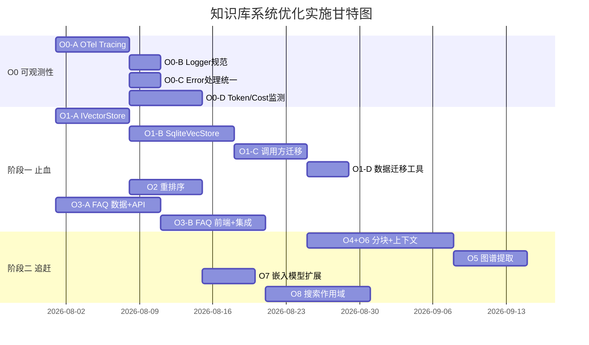

# PY_APP 知识库系统优化方案 v2

> 基于对标 WeKnora 的差距分析 | 2026-07-25 | 更新于同日
> 遵循模型管理体系：所有模型使用通过 `ModelRouter.resolve(taskType)` + 任务分工配置
> v2 变更：整合 10 条审查意见 + 补充 OTel/Logger/HandlerError/Token&Cost 监测
>
> **执行状态更新: 2026-07-25** | 总体进度: 12/14 完成 (86%)

### 执行状态概览

| 编号 | 优化项 | 状态 | 说明 |
|------|--------|:---:|------|
| O0-A | OTel Tracing | ✅ | 已接入 KnowledgeRouter/RerankService/GraphExtractor/FAQService/SqliteVecStore |
| O0-B | Logger 规范化 | ✅ | 全部使用 OTelAwareLogger + knowledge: 前缀 module |
| O0-C | Error 处理 | ✅ | ErrorCodes 已扩展 7 个知识库错误码，catch 块走 handleError |
| O0-D | LLM Token/Cost 监测 | ✅ | KnowledgeCompiler 已集成 LLMPerformanceMonitor |
| O1 | 向量数据库 | ✅ | IVectorStore + JsonlVectorStore + SqliteVecStore + VectorStoreFactory |
| O2 | 重排序模块 | ✅ | RerankService + modelRouter.resolve('reranking') |
| O3 | FAQ 知识类型 | ✅ | FAQService + 8 HTTP 端点 + 前端管理 UI |
| O4+O6 | 智能分块与上下文丰富 | ✅ | autoChunk + parentChildChunk + enrichContext |
| O5 | LLM 图谱提取 | ✅ | GraphExtractor + KnowledgeGraph + 前端可视化 |
| O7 | 嵌入模型扩展 | ⬜ | 配置型任务，通过 UI 注册 Provider + 模型即可 |
| O8 | 搜索作用域 SearchTarget | ⬜ | 需新增接口，约 1-2 周 |
| O9 | 异步任务队列 | ✅ | TaskQueue 实现 |
| O10 | 外部数据源连接器 | ✅ | DataSourceConnector + RSSConnector + 前端管理 |
| O11 | KB 克隆/复制 | ✅ | KnowledgeBaseRegistry.cloneBase/duplicateConfig + KBaseSelector 按钮 |

### 前端升级状态

| 编号 | 项目 | 状态 | 路由 |
|------|------|:---:|------|
| P1.1 | HTTP 客户端迁移 | ✅ | — |
| P1.2 | 搜索体验增强 | ✅ | `SearchHitCard` + `DomainFilter` |
| P1.3 | FAQ 管理 UI | ✅ | `/knowledge/faq` |
| P1.4 | React 18→19 | ✅ | — |
| P2.1 | GraphRAG 可视化 | ✅ | `/knowledge/graph` |
| P2.2 | AutoRAG 配置 UI | ✅ | `/knowledge/config` |
| P3.1 | 外部数据源管理 | ✅ | `/knowledge/datasources` |
| P3.2 | 健康仪表盘增强 | ⬜ | 现有 StatsPanel 已覆盖基础指标 |
| P3.3 | 克隆/复制知识库 | ✅ | KBaseSelector 按钮 |

### 待完成项

| 编号 | 项 | 预计工时 | 阻塞 |
|------|---|:---:|------|
| O7 | 嵌入模型扩展 | 0（配置型） | 无阻塞，通过 UI 注册即可 |
| O8 | 搜索作用域 SearchTarget | 1-2 周 | 需新设计接口 |

---

## 一、优化总览

### 1.1 优化范围

```
O0: 可观测性基础设施（贯穿所有优化项）★ 新增
  ├── O0-A: 知识库 OTel Tracing 接入
  ├── O0-B: Logger 规范化（module 命名 + OTel context 注入）
  ├── O0-C: 统一 Error 处理模式（handleError + AppError）
  └── O0-D: LLM Token/Cost 监测（LLMPerformanceMonitor + CostMonitor）

阶段一（止血 P0，6-7 周）★ 调整工作量
  ├── O1: 向量数据库 — sqlite-vec，通过 IVectorStore 接口抽象
  │     ├── O1-A: IVectorStore 接口 + JsonlVectorStore 改造 (1 周)
  │     ├── O1-B: SqliteVecStore 实现 + 集成测试 (1.5 周)
  │     ├── O1-C: 调用方迁移 + KnowledgeConfig 扩展 + E2E (1 周)
  │     └── O1-D: 数据迁移工具 (0.5 周)
  ├── O2: 重排序模块 — 通过 ModelRouter 任务分工使用 reranking 模型
  └── O3: FAQ 知识类型 — 新增 Q/A 数据模型与管理界面

阶段二（追赶 P1，4-5 周）
  ├── O4+O6: 智能分块与上下文丰富（合并）★
  ├── O5: LLM 图谱提取 — 文档编译后自动提取实体/关系
  ├── O7: 嵌入模型扩展 — 通过任务分工新增阿里/智谱适配器
  └── O8: 搜索作用域 — SearchTarget 精细检索控制

阶段三（深化 P2，按需）
  ├── O9: 异步任务队列
  ├── O10: 外部数据源连接器
  └── O11: KB 克隆/复制
```

### 1.2 模型使用总则

**[CS01-001] 所有模型使用必须遵循现有任务分工体系：**

```
用户在前端「任务分工」配置模型
  → PUT /v1/models/tasks { tasks: { "reranking": "uuid-xxx", "embedding": "uuid-yyy" } }
  → modelRouter.setTasks() 持久化到 DB + 更新内存缓存
  → 代码中通过 modelRouter.resolve('reranking') 获取模型
  → 通过 providerRegistry.getByModel(modelId) 获取 Provider
  → 调用 Provider API
```

**禁止事项**（按 [model-usage.md](file:///e:/PY/Documents/CODES/PY_APP/.trae/rules/model-usage.md)）：
- 禁止在代码中硬编码模型名
- 禁止在工具参数 default 中写死模型名
- 禁止绕过 `ModelRouter.resolve()` 直接取模型

---

## 二、O0: 可观测性基础设施（贯穿所有优化项）

> **背景**：当前知识库模块完全未接入 OTel Tracing/Metrics，KnowledgeMonitor 使用独立 JSONL，与平台已有的 OTel 生态割裂。Logger 实例缺少 OTel context 注入。LLM 调用的 Token/Cost 未被追踪。Error 处理模式不统一。

### O0-A: 知识库 OTel Tracing 接入

**现状**：平台已有完整的 OTel 基础设施（`app/src/infrastructure/observability/OTelTracing.ts` — `startSpan`/`endSpan`/`wrap`/`asyncWrap`，`OTelMetrics.ts` — Counter/Histogram/UpDownCounter），但知识库 0 引用。

**改造点**：

| 模块 | 需创建的 Span | 行号参考 |
|------|-------------|---------|
| `KnowledgeRouter.search()` | `knowledge.router.search` | KnowledgeRouter.ts:705 |
| `KnowledgeRouter.keywordSearch()` | `knowledge.router.keyword` | KnowledgeRouter.ts:437 |
| `KnowledgeRouter.semanticSearch()` | `knowledge.router.semantic` | KnowledgeRouter.ts:600 |
| `IVectorStore.search()` | `knowledge.vector.search` | store.ts:175 |
| `IVectorStore.upsert()` | `knowledge.vector.upsert` | 新增 |
| `KnowledgeCompiler.compile()` | `knowledge.compile` | KnowledgeCompiler.ts |
| `RerankService.rerank()` | `knowledge.rerank` | 新增 |
| `GraphExtractor.extract()` | `knowledge.graph.extract` | 新增 |
| `FAQService.*` | `knowledge.faq.*` | 新增 |
| `AutoRagService.retrieve()` | `knowledge.rag.retrieve` | AutoRagService.ts:266 |
| `EmbeddingManager.embed()` | `knowledge.embedding.embed` | EmbeddingManager.ts:144 |

**实现方式**：

```typescript
// KnowledgeRouter 示例
import { startSpan } from '@modules/infrastructure/observability/OTelTracing';

async search(query: string, options?: KnowledgeRouterOptions): Promise<KnowledgeRoute[]> {
  return startSpan('knowledge.router.search', async (span) => {
    span.setAttributes({
      'knowledge.query': query.substring(0, 200),
      'knowledge.max_results': options?.maxResults ?? 10,
    });
    // ... 原有逻辑
  });
}
```

### O0-B: Logger 规范化

**现状**：知识库模块的 Logger 实例大多缺少 `module` 字段或命名不规范。未使用 `OTelAwareLogger` 注入 traceId/spanId。

**改造点**：

1. **统一 module 命名**：所有知识库 Logger 使用 `knowledge:<子模块>` 前缀

| 文件 | 当前 module | 改为 |
|------|-----------|------|
| KnowledgeRouter.ts | 可能缺失 | `knowledge:router` |
| KnowledgeCompiler.ts | 可能缺失 | `knowledge:compiler` |
| AutoRagService.ts | 可能缺失 | `knowledge:rag` |
| KnowledgeGraph.ts | 可能缺失 | `knowledge:graph` |
| RerankService.ts | 新增 | `knowledge:rerank` |
| FAQService.ts | 新增 | `knowledge:faq` |
| SqliteVecStore.ts | 新增 | `knowledge:vector` |
| GraphExtractor.ts | 新增 | `knowledge:graph:extract` |

2. **接入 OTel context**：在创建 Logger 时传入 OTel context

```typescript
import { OTelAwareLogger } from '@modules/infrastructure/observability/OTelAwareLogger';

const logger = new OTelAwareLogger({
  level: LogLevel.INFO,
  module: 'knowledge:router',
});
// 自动在日志中注入 traceId / spanId
```

### O0-C: 统一 Error 处理模式

**现状**：知识库模块 error 处理不一致，部分 catch 块空置或仅 console.log（违反 [project_rules.md](file:///e:/PY/Documents/CODES/PY_APP/.trae/rules/project_rules.md) §1.9）。

**改造点**：

1. **所有 catch 块必须走 `handleError()`**：

```typescript
import { handleError } from '@modules/error/handleError';

try {
  await this.vectorStore.search(queryVec, topK);
} catch (e) {
  await handleError(e, { module: 'knowledge:vector', action: 'search' });
  // 根据业务场景决定是否 rethrow 或返回降级结果
}
```

2. **知识库专属错误码补充**（在 `error/ErrorCodes.ts` 中新增）：

```typescript
// 知识库相关错误码
KNOWLEDGE_INDEX_EMPTY = 'KNOWLEDGE_INDEX_EMPTY',
KNOWLEDGE_VECTOR_STORE_ERROR = 'KNOWLEDGE_VECTOR_STORE_ERROR',
KNOWLEDGE_RERANK_FAILED = 'KNOWLEDGE_RERANK_FAILED',
KNOWLEDGE_EMBEDDING_FAILED = 'KNOWLEDGE_EMBEDDING_FAILED',
KNOWLEDGE_GRAPH_EXTRACT_FAILED = 'KNOWLEDGE_GRAPH_EXTRACT_FAILED',
KNOWLEDGE_FAQ_DUPLICATE = 'KNOWLEDGE_FAQ_DUPLICATE',
KNOWLEDGE_MIGRATION_FAILED = 'KNOWLEDGE_MIGRATION_FAILED',
```

### O0-D: LLM Token/Cost 监测

**现状**：平台已有 `LLMPerformanceMonitor`（纯内存，记录 latency/tokens/cost）和 `CostMonitor`（告警规则），但知识库的所有 LLM 调用完全没有接入。

**知识库中的 LLM 调用点**：

| 调用点 | 预估 token 消耗 | 频率 |
|--------|:---:|:---:|
| KnowledgeCompiler（编译时 LLM Many-to-Many） | 高（每文件 2-8 页） | 低（compile 触发） |
| GraphExtractor（实体/关系提取） | 中（每文档 ~2K tokens） | 中（编译后自动） |
| KnowledgeDigestService（摘要生成） | 中 | 低 |
| QueryFeedbackPipeline（查询分析） | 低 | 低 |
| EmbeddingManager（嵌入生成） | 高（批量） | 中-高 |
| RerankService（重排序） | 中 | 高（每次检索） |

**改造方案**：在每个 LLM 调用包装 `trackLLMCall()`：

```typescript
import { llmPerformanceMonitor } from '@modules/monitoring/LLMPerformanceMonitor';

async compileFile(file: RawFile): Promise<CompiledPage[]> {
  return llmPerformanceMonitor.trackCall({
    model: resolvedModel,
    provider: resolvedProvider,
    moduleName: 'knowledge:compiler',
  }, async (tracker) => {
    const result = await this.callLLM(prompt);
    tracker.record({
      promptTokens: result.usage.prompt_tokens,
      completionTokens: result.usage.completion_tokens,
      latencyMs: result.latency,
    });
    return result.pages;
  });
}
```

**新增 OTel Metrics**：将 Token/Cost 指标注册为 OTel Metrics，通过 `/v1/knowledge/health` 暴露：

| 指标名 | 类型 | 标签 | 说明 |
|--------|:----:|------|------|
| `knowledge.llm.tokens` | Counter | module, model | LLM token 消耗 |
| `knowledge.llm.cost` | Counter | module, model | LLM 成本（按定价计算） |
| `knowledge.llm.latency_ms` | Histogram | module, model | LLM 调用延迟 |
| `knowledge.embedding.tokens` | Counter | model | 嵌入 token 消耗 |
| `knowledge.rerank.tokens` | Counter | model | 重排序 token 消耗 |

### O0 工作量汇总

| 子任务 | 工作量 |
|--------|:------:|
| O0-A: OTel Tracing 接入 11 个 span | 1 周 |
| O0-B: Logger 规范化 | 0.5 周 |
| O0-C: Error 处理统一 | 0.5 周 |
| O0-D: Token/Cost 监测 | 1 周 |
| **合计** | **约 3 周（可与阶段一并行）** |

### O0 验收标准

- [ ] 知识库所有关键路径有 OTel Span，查询 latency P99 可监控
- [ ] 所有 Logger 使用 `knowledge:*` module 命名 + OTelAwareLogger
- [ ] 所有 catch 块走 `handleError()`，知识库专属错误码已定义
- [ ] LLMPerformanceMonitor 记录所有知识库 LLM 调用，Token/Cost 指标可通过 `/v1/knowledge/health` 查看

---

## 三、阶段一：止血（P0）

### O1: 向量数据库集成

**目标**：用专业向量存储替代 JSONL 线性扫描，支撑 100 万+ 分块规模。

#### 选型决策

| 因素 | sqlite-vec | pgvector | Qdrant (sidecar) |
|------|:----------:|:--------:|:----------------:|
| 当前架构兼容性 | ✅ 零破坏，复用 app.db | ❌ 需引入 PostgreSQL | ❌ 需独立进程 |
| 成熟度 | ⚠️ 社区项目 | ✅ 行业标准 | ✅ 专用向量 DB |
| 百万级规模性能 | ⚠️ 待验证 | ✅ 已验证 | ✅ 最佳性能 |
| 运维复杂度 | 低（无新增进程） | 中（需维护 PG 实例） | 中-高 |
| **推荐** | **阶段一首选** | **阶段二升级目标** | 不选 |

**双阶段升级路径**：
- 阶段一：sqlite-vec（快速交付，零破坏，通过 IVectorStore 接口抽象）
- 阶段二（可选）：在 IVectorStore 接口不变的前提下新增 PgVectorStore，用户可配置切换

#### 子任务拆分

**O1-A: IVectorStore 接口抽象 + JsonlVectorStore 改造（1 周）**

新建 `app/src/knowledge/semantic/IVectorStore.ts`：

```typescript
export interface IVectorStore {
  upsert(entries: VectorEntry[]): Promise<void>;
  search(queryVec: Float32Array, topK: number, minScore?: number): Promise<SearchHit[]>;
  deleteByPath(path: string): Promise<void>;
  clear(): Promise<void>;
  count(): Promise<number>;
  getMeta(): Promise<IndexMeta | null>;
  setMeta(meta: IndexMeta): Promise<void>;
  getById(id: string): Promise<VectorEntry | null>;  // O4+O6 上下文丰富需要
}

export interface VectorEntry {
  id: string;
  path: string;
  startLine: number;
  endLine: number;
  text: string;
  embedding: Float32Array;
  mtimeMs: number;
  metadata?: Record<string, unknown>;
}
```

现有 `SemanticStore` 改为 `JsonlVectorStore implements IVectorStore`（保留，不删除）。`VectorStoreFactory` 根据环境变量 `VECTOR_STORE` 选择实现。

**O1-B: SqliteVecStore 实现 + 集成测试（1.5 周）**

新建 `app/src/knowledge/semantic/SqliteVecStore.ts`：

```typescript
export class SqliteVecStore implements IVectorStore {
  constructor(
    private dbPath: string = resolveDbPath(),
    private tableName: string = 'kb_vectors'
  ) { }

  async search(queryVec: Float32Array, topK: number, minScore = 0.3): Promise<SearchHit[]> {
    // sqlite-vec 的 vec_distance_cosine → 余弦距离，1 - distance = 相似度
    // SELECT id, path, text, 1 - vec_distance_cosine(embedding, ?) AS score
    // FROM kb_vectors WHERE 1 - vec_distance_cosine(embedding, ?) >= ?
    // ORDER BY score DESC LIMIT ?
  }
}
```

**O1-C: 调用方迁移 + KnowledgeConfig 扩展 + E2E（1 周）**

将 `KnowledgeRouter`、`IndexBuilder`、`SemanticIndexUpdater`、`AutoRagService` 中的 `SemanticStore` 直接依赖改为 `IVectorStore` 接口。

`KnowledgeConfig` 新增：

```typescript
vectorStore?: {
  type: 'jsonl' | 'sqlite_vec';
  topK: number;         // 默认 10
  minScore: number;     // 默认 0.3
};
```

**O1-D: 存量数据迁移（0.5 周）**

```typescript
// MigrationService — 从 JSONL 到目标向量存储
export class MigrationService {
  async migrate(from: IVectorStore, to: IVectorStore): Promise<MigrationReport> {
    // 批量读取 JSONL → 逐批写入目标存储
    // 保留原始 id/path/mtimeMs 保证增量更新不重复
    // 完成后写入 migration_done 标记
  }
}
```

**迁移触发规则**：
- 启动时检测：`from`(JSONL) 有数据且 `to`(sqlite-vec) 为空 → 自动提示用户迁移
- 迁移在后台异步执行（进度通过 `CompileProgressTracker` 反馈）
- 迁移完成后自动切换，保留 JSONL 作为回退

#### 验收标准

- [ ] `IVectorStore` 接口定义并通过 TypeScript 编译
- [ ] `JsonlVectorStore` 符合接口，现有测试全部通过（回归验证）
- [ ] `SqliteVecStore` 写入 10 万条分块，搜索 P50 < 50ms
- [ ] `KnowledgeRouter` 通过工厂创建向量存储，行为与现有一致
- [ ] `VECTOR_STORE=sqlite_vec` 环境变量切换生效
- [ ] 数据迁移工具端到端验证通过

#### 降级策略

| 场景 | 降级行为 |
|------|---------|
| sqlite-vec 原生模块加载失败 | 自动回退到 JsonlVectorStore，记录 warning 日志 |
| 迁移过程中断 | 保留 JSONL 源数据，下次启动从中断点继续 |
| sqlite-vec 搜索超时 | fallback 到 JsonlVectorStore，触发告警 |

---

### O2: 重排序模块

**目标**：在检索流程中插入重排序步骤，提升检索精度。

**关键约束**：重排序模型必须通过现有任务分工体系获取，不可硬编码。

#### 实施步骤

**Step 1: 补齐 handleListModels 的 reranking 类型映射**

修改 [ModelManagementAPI.ts](file:///e:/PY/Documents/CODES/PY_APP/app/src/ai/ModelManagementAPI.ts) 第 1176-1185 行：

```typescript
const modelType = caps.includes(ModelCapability.IMAGE_GENERATION)
  ? 'image'
  : caps.includes(ModelCapability.VIDEO_GENERATION)
    ? 'video'
    : caps.includes(ModelCapability.RERANKING)     // ← 新增
      ? 'reranking'
      : caps.includes(ModelCapability.EMBEDDING)
        ? 'embedding'
        : caps.includes(ModelCapability.TEXT_TO_SPEECH) ||
            caps.includes(ModelCapability.SPEECH_RECOGNITION)
          ? 'voice'
          : 'chat';
```

**Step 2: 扩展 AIProvider 接口**

在 [AIProvider.ts](file:///e:/PY/Documents/CODES/PY_APP/app/src/ai/AIProvider.ts) 新增可选方法：

```typescript
export interface RerankRequest {
  query: string;
  documents: string[];
  topN?: number;
  returnDocuments?: boolean;
}

export interface RerankResult {
  results: Array<{ index: number; document?: string; relevanceScore: number }>;
  model: string;
  usage?: { totalTokens: number };
}

export interface AIProvider {
  // ... 现有方法 ...
  rerank?(request: RerankRequest): Promise<RerankResult>;  // 可选
}
```

**Step 3: 实现 RerankService**

新建 `app/src/knowledge/RerankService.ts`：

```typescript
import { modelRouter } from '@modules/ai/modelRouter';
import { providerRegistry } from '@modules/ai/providers/ProviderRegistry';

export class RerankService {
  async rerank(query: string, docs: RerankDocument[], topN?: number): Promise<RerankDocument[]> {
    if (docs.length === 0) return [];

    // 1. 通过 ModelRouter 获取用户配置的 reranking 模型
    const route = modelRouter.resolve('reranking');
    if (!route) {
      throw new AppError(ErrorCode.MODEL_NOT_CONFIGURED,
        '未配置重排序模型，请在 模型管理 → 任务分工 中配置 reranking 任务');
    }

    // 2. 通过 ProviderRegistry 获取 Provider
    const provider = providerRegistry.getByModel(route.model);
    // ★ 类型守卫：检查 rerank 方法是否存在
    if (!provider || typeof provider.rerank !== 'function') {
      throw new AppError(ErrorCode.PROVIDER_NOT_SUPPORTED,
        `Provider "${route.providerId}" 不支持重排序`);
    }

    // 3. 调用 rerank API
    const result = await llmPerformanceMonitor.trackCall(
      { model: route.model, provider: route.providerId, moduleName: 'knowledge:rerank' },
      async () => provider.rerank({
        query, documents: docs.map(d => d.content),
        topN: topN ?? Math.min(docs.length, 10),
      })
    );

    return result.results
      .sort((a, b) => b.relevanceScore - a.relevanceScore)
      .map(r => ({ ...docs[r.index], score: r.relevanceScore }));
  }
}
```

**Step 4: 在 KnowledgeRouter 中接入重排序**

在 `search()` 融合后、返回前插入重排序。构造函数新增可选参数 `rerankService?: RerankService`。

#### 降级策略

| 场景 | 行为 |
|------|------|
| `modelRouter.resolve('reranking')` 返回 null（用户未配置） | 跳过重排序，返回原始融合结果 |
| Provider 不支持 `rerank` 方法 | 跳过重排序，记录 warning |
| rerank API 超时/限流（3 次重试后仍失败） | 跳过重排序，记录 error，触发告警 |

#### 验收标准

- [ ] `handleListModels()` 正确将 `reranking` capability 映射为 `type: 'reranking'`
- [ ] `RerankService.rerank()` 通过 `modelRouter.resolve('reranking')` 获取模型
- [ ] 类型守卫确保 Provider 支持 rerank 后再调用
- [ ] 重排序后结果按 relevanceScore 降序
- [ ] 重排序失败时优雅降级，不影响搜索可用性
- [ ] Token/Cost 被 `LLMPerformanceMonitor` 记录

---

### O3: FAQ 知识类型

**目标**：新增 Q/A 结构化知识类型，覆盖客服/帮助场景。

#### 数据模型

```typescript
export interface FAQEntry {
  id: string;
  knowledgeBaseName: string;
  standardQuestion: string;
  similarQuestions: string[];
  answer: string;
  tags: string[];
  category: string;
  enabled: boolean;
  recommended: boolean;
  contentHash: string;      // SHA256(question + answer) 去重
  embeddingStatus?: 'pending' | 'done' | 'failed';  // 降级标记
  createdAt: number;
  updatedAt: number;
}
```

#### 存储方案

SQLite 表 `faq_entries`（复用 app.db）：

```sql
CREATE TABLE faq_entries (
  id              TEXT PRIMARY KEY,
  knowledge_base  TEXT NOT NULL,
  question        TEXT NOT NULL,
  similar_questions TEXT DEFAULT '[]',
  answer          TEXT NOT NULL,
  tags            TEXT DEFAULT '[]',
  category        TEXT DEFAULT '',
  enabled         INTEGER DEFAULT 1,
  recommended     INTEGER DEFAULT 0,
  content_hash    TEXT NOT NULL,
  embedding_status TEXT DEFAULT 'pending',
  created_at      INTEGER NOT NULL,
  updated_at      INTEGER NOT NULL
);
```

#### 检索集成

FAQ 创建/更新时自动生成语义向量存入向量存储。检索时 FAQ 结果与文档结果融合。

#### 降级策略

| 场景 | 行为 |
|------|------|
| 嵌入生成失败 | FAQ 条目仍写入 DB，标记 `embeddingStatus='failed'`，仅可通过关键词搜索命中 |
| 批量导入中一条失败 | 跳过该条，继续导入其余，汇总报告失败条目 |

#### 实施步骤

| # | 步骤 | 工作量 |
|---|------|:------:|
| 1 | 定义类型 + 创建表 | 1 天 |
| 2 | FAQService（CRUD + 去重 + 推荐） | 3 天 |
| 3 | FAQHandler（HTTP API） | 2 天 |
| 4 | 批量导入（CSV/JSON + 进度反馈） | 2 天 |
| 5 | 前端 FAQ 管理页面 | 3 天 |
| 6 | 检索集成 | 2 天 |

**工作量**：中型（约 2-3 周）

---

## 四、阶段二：追赶（P1）

### O4+O6: 智能分块与上下文丰富（合并）

> **合并原因**：O4 的父子分块/标题感知分块产生的 `parentChunkId`/`contextHeader`/`preChunkId`/`nextChunkId` 是 O6 的数据基础，分两个阶段实施会引入接口稳定性风险。

#### 实施顺序

```
Step 1: 扩展 CodeChunk 接口（新增 preChunkId/nextChunkId/parentChunkId/contextHeader）
Step 2: 实现 HeadingAwareChunker + ParentChildChunker + AutoChunker
Step 3: 在构建索引时填充关联字段
Step 4: 在 KnowledgeRouter 结果后处理中实现上下文富化
```

#### 分块策略

在 [chunker.ts](file:///e:/PY/Documents/CODES/PY_APP/app/src/knowledge/semantic/chunker.ts) 中扩展：

```typescript
// CodeChunk 扩展（现有 Ln 34-43 + 新增）
export interface CodeChunk {
  path: string; startLine: number; endLine: number; text: string;
  // 新增字段
  preChunkId?: string;
  nextChunkId?: string;
  parentChunkId?: string;
  contextHeader?: string;    // 如 "## 安装指南 > ### Docker 部署"
}

// 自适应策略选择
export function autoChunk(text: string, options?: ChunkOptions): CodeChunk[] {
  const hasHeadings = /^#{1,6}\s/m.test(text);
  const isCode = text.includes('```') || text.includes('function ');
  if (hasHeadings) return headingAwareChunk(text, options);
  if (text.length < 10000) return chunkText(text, options);
  return recursiveChunk(text, options);
}
```

#### 上下文富化

在 `KnowledgeRouter.search()` 融合后新增：

```typescript
// 对每个检索结果，附加前后块和父块内容
async enrichContext(routes: KnowledgeRoute[]): Promise<EnrichedRoute[]> {
  return Promise.all(routes.map(async (route) => {
    const chunk = await this.vectorStore.getById(`${route.docPath}#L${...}`);
    const context: string[] = [];
    if (chunk?.contextHeader) context.push(`[上下文] ${chunk.contextHeader}`);
    if (chunk?.preChunkId) { /* 获取上文 500 字符 */ }
    if (chunk?.nextChunkId) { /* 获取下文 500 字符 */ }
    if (chunk?.parentChunkId) { /* 获取父块 2000 字符 */ }
    return { ...route, context: context.join('\n---\n') };
  }));
}
```

**工作量**：中型（约 2 周）

---

### O5: LLM 图谱自动提取

**目标**：文档编译后，通过 LLM 自动提取实体和关系。

> **修正**：`GraphExtractor` 不直接注入 `AIService`，而是通过 `modelRouter.resolve('quick')` 获取对话模型。

```typescript
export class GraphExtractor {
  constructor(private knowledgeGraph: KnowledgeGraph) {}

  async extract(content: string, domain: string): Promise<void> {
    // 1. 通过 ModelRouter 获取模型配置
    const route = modelRouter.resolve('quick');
    if (!route) {
      logger.warning('图谱提取：未配置 quick 任务模型，跳过');
      return;  // 非阻塞降级
    }

    // 2. 调用 LLM
    return llmPerformanceMonitor.trackCall(
      { model: route.model, provider: route.providerId, moduleName: 'knowledge:graph:extract' },
      async (tracker) => {
        const response = await this.callLLM(buildPrompt(content, domain));
        tracker.record({ promptTokens: ..., completionTokens: ... });
        // 3. 写入 kg_edges
        for (const edge of parseEdges(response)) {
          await this.knowledgeGraph.addEdge({ ...edge, domain });
        }
      }
    );
  }
}
```

#### 降级策略

| 场景 | 行为 |
|------|------|
| LLM 调用失败 | 跳过该文档图谱提取，不阻塞编译管线，记录 to error log |
| 提取结果无法解析 | 跳过，记录 warning |
| quick 任务未配置模型 | 跳过，不发 error |

#### 工作量：小型（约 1 周）

---

### O7: 嵌入模型扩展

**目标**：新增阿里 DashScope、智谱等嵌入模型。

> **修正**：原方案"无需代码修改"过于绝对。阿里 DashScope 和智谱虽然兼容 OpenAI 格式，但 base URL、认证方式可能不同。正确表述为：

**通常无需新增适配器代码**，因为阿里 DashScope 和智谱的嵌入 API 兼容 OpenAI 格式。只需在「模型管理」UI 中：
1. 注册 Provider（配置正确的 base URL 和认证方式）
2. 注册模型（设置 `capabilities: ["embedding"]`）
3. 在「任务分工」中将 `embedding` 任务指向新模型

若遇到非 OpenAI 兼容的嵌入 API，需新增适配器（参考现有 `OpenAIEmbeddingProvider` 实现），每种约半天。

---

### O8: 搜索作用域（SearchTarget）

与初版方案一致，新增 `SearchTarget` 接口支持按 KB/Knowledge/Tag 限缩检索范围。约 1-2 周。

---

## 五、阶段三：深化（P2，按需）

O9-O11 与初版方案一致（异步任务队列 / 外部数据源连接器 / KB 克隆复制）。

---

## 六、降级策略矩阵

> 所有涉及外部 API/模块调用的优化项，必须定义降级策略。遵循 [coding-standards.md](file:///e:/PY/Documents/CODES/PY_APP/.trae/rules/coding-standards.md) CS03。

| 优化项 | 失败场景 | 降级行为 | 用户感知 | 日志级别 |
|--------|---------|---------|---------|:------:|
| O1 向量存储 | sqlite-vec 模块加载失败 | 自动回退到 JsonlVectorStore | 搜索可能变慢 | WARNING |
| O1 向量存储 | 迁移过程中断 | 保留 JSONL 源数据，下次从中断点继续 | 无感知 | WARNING |
| O1 向量存储 | sqlite-vec 搜索超时（>2s） | fallback 到 JsonlVectorStore，触发告警 | 搜索可能变慢 | ERROR |
| O2 重排序 | `modelRouter.resolve('reranking')` 返回 null | 跳过重排序，返回原始融合结果 | 搜索结果精度不变 | INFO |
| O2 重排序 | Provider 不支持 `rerank` 方法 | 跳过重排序 | 不变 | WARNING |
| O2 重排序 | rerank API 超时/限流（3 次重试后） | 跳过重排序，记录 error 日志 | 不变 | ERROR |
| O5 图谱提取 | LLM 调用失败 | 跳过该文档提取，不阻塞编译管线 | 少量文档无自动提取的实体 | ERROR |
| O5 图谱提取 | 提取结果 JSON 解析失败 | 跳过该文档，记录 warning | 同上 | WARNING |
| O5 图谱提取 | quick 任务未配置模型 | 跳过，不报 error | 无感知 | WARNING |
| O3 FAQ | 嵌入生成失败 | FAQ 条目仍写入 DB，标记 `embedding_pending` | FAQ 暂不可语义命中 | ERROR |
| O3 FAQ | 批量导入中单条失败 | 跳过该条，继续导入其余，汇总报告 | 导入报告显示失败条目 | WARNING |
| O7 嵌入 | 嵌入 API 调用失败 | 回退到本地 Ollama embedding | 精度可能略降 | WARNING |

---

## 七、性能基准测试规范

### 测试环境

用户实际运行环境（Bun + SQLite），无特殊硬件要求。

### 测试数据集

| 数据规模 | 分块数量 | 向量维度 | 典型场景 |
|----------|:--------:|:--------:|---------|
| S（小） | 1,000 | 768 | 个人知识库 |
| M（中） | 50,000 | 768 | 团队知识库 |
| L（大） | 500,000 | 768 | 企业级 |

### 性能指标

| 指标 | JSONL 基线 | O1 目标 (sqlite-vec) | O2 目标 (含重排序) |
|------|:----------:|:--------------------:|:------------------:|
| 语义搜索 P50 (M 规模) | ~500ms | <50ms | <80ms |
| 语义搜索 P99 (L 规模) | N/A | <200ms | <300ms |
| 写入吞吐 (ops/s) | ~100 | >1000 | — |
| 重排序 P50 (100 文档) | N/A | — | <500ms |

---

## 八、实施计划

### 关键依赖关系

```
O0（可观测性）与 O1 并行 ─┐
                          ├─→ O2 重排序 ─→ O7 嵌入扩展
                          │
O1-A 接口抽象 ─→ O1-B SqliteVecStore ─→ O1-C 迁移 ─→ O1-D 数据迁移
                          │
O3 FAQ（独立并行） ──────────────────→ O8 搜索作用域
                          │
                          └─→ O4+O6 智能分块+上下文 ─→ O5 图谱提取
```

### 甘特图



**关键路径**: O1-A → O1-B → O1-C → O4+O6 → O5（约 8 周）
**非关键路径**：O3 FAQ + O8（约 4 周，可在内部并行）、O2 + O7（约 2.5 周）

### 阶段一总工期

O0 与 O1 并行：约 **7 周**（O1 关键路径 4 周，加上 O2 的 1 周和 O3 的 3 周，考虑并行后总工期约 7 周）

---

## 九、可观测性指标总览

### OTel Metrics 注册表

| 组件 | 指标名 | 类型 | 告警阈值 |
|------|--------|:----:|:------:|
| IVectorStore.search() | `knowledge.vector.search.duration_ms` | Histogram | P99 > 500ms |
| IVectorStore.upsert() | `knowledge.vector.upsert.count` | Counter | — |
| IVectorStore.search() | `knowledge.vector.search.error_count` | Counter | > 5/min |
| RerankService.rerank() | `knowledge.rerank.duration_ms` | Histogram | P99 > 2000ms |
| RerankService.rerank() | `knowledge.rerank.error_count` | Counter | > 5/min |
| EmbeddingManager | `knowledge.embedding.tokens` | Counter | — |
| RerankService | `knowledge.rerank.tokens` | Counter | — |
| KnowledgeCompiler | `knowledge.compile.tokens` | Counter | — |
| GraphExtractor | `knowledge.graph.tokens` | Counter | — |
| FAQService | `knowledge.faq.entry_count` | Gauge | — |
| MigrationService | `knowledge.migration.progress` | Gauge | — |

### 日志规范

| 场景 | 级别 | module | 示例 |
|------|:----:|--------|------|
| 搜索请求 | INFO | `knowledge:router` | `search: query="${q}" results=${n} latency=${ms}ms` |
| 语义搜索 fallback | WARNING | `knowledge:router` | `sqlite-vec unavailable, fallback to jsonl` |
| 重排序跳过 | INFO | `knowledge:rerank` | `rerank skipped: model not configured` |
| 重排序失败 | ERROR | `knowledge:rerank` | `rerank failed: ${err}, falling back` |
| LLM 提取成功 | INFO | `knowledge:graph:extract` | `extracted ${n} entities, ${m} relations` |
| LLM 提取失败 | WARNING | `knowledge:graph:extract` | `graph extraction failed: ${err}, skipping doc` |
| 向量存储切换 | INFO | `knowledge:vector` | `migrated ${n} entries jsonl→sqlite_vec` |

---

## 十、风险与注意事项

| 风险 | 缓解措施 |
|------|---------|
| sqlite-vec 成熟度不足 | 通过 `IVectorStore` 接口抽象，可随时切换 Postgres pgvector 或其他实现 |
| 重排序模型提供商 API 不统一 | 仅实现 OpenAI 兼容格式（覆盖硅基流动、阿里、Jina 等主流提供商） |
| 分块策略变更影响已有索引 | 新旧策略通过 `chunk_strategy_version` 标记区分，旧索引继续可用 |
| 任务分工配置错误导致模型不可用 | ModelRouter 已有 `validateTaskAssignment()`，启动时自动检测 |
| O1 调用方迁移导致回归 | 分步骤迁移，每步验证现有测试通过 |
| LLM 成本失控 | O0-D Token/Cost 监测 + `CostMonitor` 告警规则 |

---

## 十一、模型使用对照表

> 所有操作遵循 [model-usage.md](file:///e:/PY/Documents/CODES/PY_APP/.trae/rules/model-usage.md) 规范。

| 优化项 | TaskType | 获取方式 | 备注 |
|--------|:---:|------|------|
| 向量嵌入 | `embedding` | `modelRouter.resolve('embedding')` → `EmbeddingManager` | 已有 |
| 重排序 | `reranking` | `modelRouter.resolve('reranking')` → `RerankService` | 新增 |
| 图谱提取 | `quick` | `modelRouter.resolve('quick')` → `AIService` | 不新增 taskType |
| 文档编译 | `quick` | `modelRouter.resolve('quick')` | 已有 |
| 新嵌入模型 | `embedding` | 同 embedding，仅 UI 注册模型+配置分工 | 通常无需代码改动 |

---

## 十二、用户升级指南

### 场景 1：纯新增用户

安装后默认使用 `VECTOR_STORE=sqlite_vec`，无需额外操作。

### 场景 2：已有 JSONL 数据的用户

- 升级后首次启动，自动检测存量数据
- 健康端点显示迁移状态：`/v1/knowledge/health` → `migration.pending: true, migration.entries: 123`
- 弹窗提示：「检测到 123 条现有知识索引，是否迁移到新的向量存储？」
- 提供选项：立即迁移 / 稍后提醒 / 跳过（继续使用 JSONL）

### 场景 3：配置变更

- 用户可在知识库设置中切换 `vectorStore.type`
- 切换时自动触发迁移（若目标存储为空）
- `VECTOR_STORE=jsonl` 永远可用作为降级方案

### 场景 4：性能不足

- 若 sqlite-vec 性能不满足需求，可在「设置」中切换为 pgvector
- 需要用户自行部署 PostgreSQL + pgvector 扩展
- 通过 IVectorStore 接口切换，无需改代码

---

## 十三、产出物索引

| 文件 | 内容 |
|------|------|
| [report.md](report.md) | 对标分析总结报告 |
| [Liri_Deficiency_Report.md](Liri_Deficiency_Report.md) | 不足分析专项报告（已同步修复选型矛盾） |
| [Detailed_Comparison_Matrix.md](Detailed_Comparison_Matrix.md) | 细化对比矩阵 |
| [Liri_Module_Deep_Dive.md](Liri_Module_Deep_Dive.md) | 逐模块深度分析 |
| **本文件** | 优化方案 v2（整合 10 条审查意见 + OTel/Logger/Error/TokenCost） |
