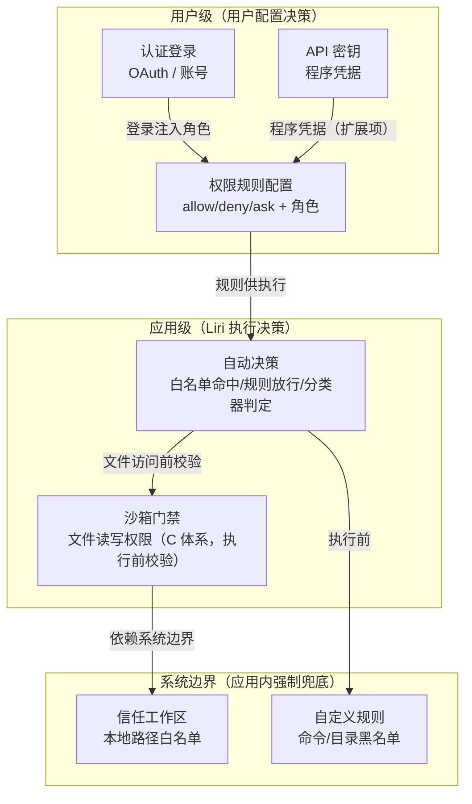

# 安全功能拉通设计方案

> 日期：2026-08-05 | 范围：权限 / API 密钥 / 信任工作区 / 自定义规则 / OAuth 认证 五块安全功能的关系拉通 + 前端透明化
> 定位：设计文档（供评审确认后执行）
> 概念框架（2026-08-05 用户确认）：**app 与 client 均部署于客户终端（本地应用）**。权限管理实质只有三级——**系统级（操作系统）／用户级（用户明确操作）／应用级（Liri 直接执行）**。本文以三级为纲组织五块功能。

---

## 一、背景与目标

### 1.1 部署形态

- **app**：终端应用（运行在客户终端，`app/` 后端 + 本地服务）
- **client**：终端的前端页面（`client/`，渲染 app 的本地 HTTP 服务）
- 无云端多租户/多用户体系——权限管理是**单终端本地语义**的三级模型

### 1.2 三级权限模型（本文核心框架）

| 级别 | 决策主体 | 含义 | 典型例子 |
|---|---|---|---|
| **系统边界** | 应用内最高优先级强制策略（非 OS 授权） | 应用触达系统资源的**边界兜底**（文件/危险命令），**任何一级都无法覆盖**。⚠ 术语澄清：并非"操作系统授权"，而是应用内 fail-closed 兜底，前端文案用"系统边界/强制兜底"避免用户误以为需改系统设置 | 信任工作区、自定义规则（危险拦截） |
| **用户级** | 用户 | 用户**配置决策**：登录、确认/拒绝、创建凭据、配置规则与角色 | 登录、ask 确认、API 密钥、角色、权限规则配置 |
| **应用级** | Liri | Liri 依据规则/分类器**执行决策**（规则命中、自动分类） | 白名单放行、规则命中、自动分类 |

**决策流**：`应用级（执行决策）→ 用户级（确认/拒绝）→ 系统边界（强制兜底）`

### 1.3 问题

应用存在 5 块安全相关功能，各自独立页面/面板、无统一入口，用户无法一眼区分"谁管什么、彼此什么关系"：

| 功能 | 前端入口 | 现状 |
|---|---|---|
| 权限 | `/permissions` + 设置 tab | ✅ 完整（工具规则/角色/用户） |
| API 密钥 | `/apikeys` + 设置 tab | ✅ 完整（`/v1/apikeys` CRUD） |
| 信任工作区 | 设置 tab | ⚠️ 前端可用，**后端消费断裂（配置不生效）** |
| 自定义规则 | 设置 tab | ⚠️ 前端可用，**后端消费断裂（配置不生效）** |
| OAuth 认证 | `/oauth` + 设置 tab | ⚠️ **前端硬编码 mock，后端仅 MCP OAuth callback** |

### 1.4 目标

1. **关系拉通**：5 块功能映射到"系统级 / 用户级 / 应用级"三级，明确数据流与打通点
2. **前端透明**：用户一眼看出每块属于哪一级、回答什么问题、与其他块的区别
3. **治理规范**：清 mock（CS04）、**假交互红线**（可交互控件必须真实持久化，否则只读展示）、去入口重复、统一"安全"信息架构

---

## 二、现状盘点（事实核查 2026-08-05）

### 2.1 权限（用户级 + 应用级，核心）

> 层级归属：**用户级**（规则/角色配置、ask 确认）＋ **应用级**（规则命中自动决策）

| 项 | 事实 |
|---|---|
| 前端 | `client/src/components/views/PermissionPage.tsx`（独立路由 `/permissions` + 设置 tab 薄包装） |
| 后端 | `permission/` 6 套体系（A 工具执行 / B 安全空壳 / C 沙箱 / D 细粒度 / E 认证 / F 技能） |
| API | `GET/POST/DELETE /v1/permissions/rules`、`/v1/permissions/{users,roles,resources}`、`/v1/permissions/grants`、`/v1/permissions/metrics` |
| 数据 | `permissions/tool_rules.json`（A）+ `permissions/{rules,roles,users,resources}.json`（D） |
| 真实度 | ✅ 完整（规则/角色/用户 API 均真实）；⚠ 前端用户详情"信任等级/角色"编辑为**假交互**（仅本地 state，无 API 持久化，刷新即失效） |

### 2.2 API 密钥（用户级 · 程序凭据）

> 层级归属：**用户级**（用户创建的程序凭据，代表用户授权）

| 项 | 事实 |
|---|---|
| 前端 | `ApiKeyPage.tsx`（`/apikeys`）+ 设置 tab `ApiKeyContent`（两处） |
| 后端 | `/v1/apikeys` GET/POST/DELETE（handleListApiKeys / handleCreateApiKey / handleDeleteApiKey） |
| 数据 | auth tokens / api keys（**内存 Map，重启丢失**，`apikey-handlers.ts`） |
| 消费 | 程序化访问（脚本/外部系统）；**创建接口忽略 permissions 参数（固定 `['read']`）** |
| 真实度 | ⚠️ 可用但不持久化、permissions 语义未落地（文档此前"✅ 完整"为高估） |

### 2.3 信任工作区（系统级 · 文件边界）

> 层级归属：**系统级**（应用触达本地文件系统的访问边界）
> ⚠ **数据不一致（2026-08-05 代码实证）**：前端面板存储与后端消费 key 不一致，配置**不生效**（详见下）

| 项 | 事实 |
|---|---|
| 前端 | `settings/TrustedWorkspacesPanel.tsx`（设置 tab `trusted-workspaces`） |
| 前端存储 | `GET/PUT /v1/config/permission.workspaces`（**flat key**）→ `config["permission.workspaces"] = { mode: default\|strict\|permissive, trustedWorkspaces: [{path, trustLevel: chat\|work\|development, enabled}] }` |
| 后端消费 | `configManager.getConfigValue('permission')` 后取 `.trustedWorkspaces`（来自 `main.ts`/`BootPipelineIntegrator` 的 `LIRI_TRUSTED_WORKSPACE` 环境变量注入） |
| **不一致** | 前端写 `permission.workspaces`（flat key），后端读 `permission.trustedWorkspaces`（`config.permission` 顶层）→ **面板配置不被 `filesystem.ts` 消费** |
| 附带 | `hooks/utils/SecurityManager.ts` 另有独立内存态 `trustState.trustedWorkspaces`（第三套实现） |
| 真实度 | ⚠️ 前端可用，后端消费链路断裂 |

### 2.4 自定义规则（系统级 · 危险操作兜底）

> 层级归属：**系统级**（危险命令/目录强制拦截，任何一级无法覆盖）
> ⚠ **数据不一致（2026-08-05 代码实证）**：前端面板存储与后端消费 key 不一致，配置**不生效**（详见下）

| 项 | 事实 |
|---|---|
| 前端 | `settings/CustomRulesPanel.tsx`（设置 tab `custom-rules`，4 tab：命令黑/白名单 + 目录黑/白名单） |
| 前端存储 | `GET/PUT /v1/config/permission.rules`（**flat key**）→ `config["permission.rules"] = { customRules: { commandRules{mode, whitelist, blacklist}, directoryRules{whitelist, blacklist} } }` |
| 后端消费 | `configManager.getConfigValue('permission')` 后取 `.customRules.directoryRules.blacklist`（`permission/filesystem.ts` 的 `getMergedDangerousFiles/getMergedDangerousDirectories`） |
| **不一致** | 前端写 `permission.rules`（flat key），后端读 `config.permission.customRules` → **面板配置不被消费** |
| 真实度 | ⚠️ 前端可用，后端消费链路断裂 |

### 2.5 OAuth 认证（用户级 · 身份，当前未接入）

> 层级归属：**用户级**（人的身份/登录，用户明确操作）

| 项 | 事实 |
|---|---|
| 前端 | `views/OAuthPage.tsx`（`/oauth`）+ 设置 tab 薄包装；**providers 为硬编码 mock**（google/github/azure 假 clientId） |
| 后端 | **`app/src/oauth/` 引擎已完备**（Google/GitHub/Base Provider、AuthorizationCode/DeviceAuthorization Flow、OAuthService/TokenManager/OAuthStorage/OAuthStartup），但**仅被 MCP/Codex 通道消费，无通用 HTTP Provider 管理 API**；另有 `/v1/mcp/oauth/callback` |
| 语义 | 第三方账号登录（人），当前未接入认证层 |
| 真实度 | ⚠️ 前端 **mock（CS04 违规）**；后端引擎存在仅缺 HTTP 层（M5 成本应重新评估） |

### 2.6 现状问题汇总

1. **入口重复**：权限 / API 密钥 / OAuth 均有"独立路由 + 设置 tab"双入口，且设置 tab 是薄包装复用同一组件——无主次、易混
2. **OAuth mock**：前端假数据（CS04 零容忍）
3. **无关系说明**：5 块页面无统一定位/区别提示，用户不知"信任工作区"与"权限"边界
4. **身份未全量拉通**：E↔A 已打通（login/register 注入角色），但 **API 密钥身份未注入权限角色**（程序凭据不影响决策）
5. **【P0】系统级配置不生效**（2026-08-05 代码实证）：前端"信任工作区"/"自定义规则"面板写 `permission.workspaces` / `permission.rules`（flat key），后端消费 `config.permission.trustedWorkspaces` / `config.permission.customRules` → **面板配置不被后端消费**；另有 `SecurityManager.trustState` 第三套内存实现
6. **【P1】API 密钥不持久化 + permissions 语义缺失**：`apikey-handlers` 内存 Map（重启丢失），创建固定 `['read']` 忽略前端 permissions 参数
7. **【P1】PermissionPage 用户编辑假交互**：`updateUserTrustLevel/updateUserRole/togglePermission` 仅本地 state，无 API 调用、无保存按钮，刷新即失效（用户误以为已生效）

---

## 三、三级权限模型（五块功能映射）



> 注：沙箱（C 体系）归**应用级执行前门禁**（依赖系统边界文件白名单），不再画入系统边界子图，避免三级模型自相矛盾。

**五块功能 → 三级归属**（前端呈现核心）：

| 功能 | 级别 | 回答的问题 | 能否被上级覆盖 |
|---|---|---|---|
| 权限（规则/角色/自动决策） | 用户级（配置）+ 应用级（执行） | 工具/操作允不允许执行 | — |
| API 密钥 | 用户级 | 程序凭什么访问 | 用户可删（凭据作废） |
| OAuth 认证 | 用户级 | 人是谁（第三方登录） | 用户可退出（方向待定，见 §4.4） |
| 信任工作区 | 系统边界 | 允许 AI 碰哪些本地路径 | **不可**（强制兜底） |
| 自定义规则 | 系统边界 | 哪些危险命令/目录必拦 | **不可**（强制兜底） |

**决策流**：`应用级执行决策 → 用户级（ask 确认/角色 deny）→ 系统边界（文件边界 + 危险兜底）`

---

## 四、拉通设计

### 4.1 用户级：身份 → 角色 → 权限（打通点 1，已有部分）

- **已实现**：OAuth/账号登录（login/register）→ `PermissionManager.setCurrentUserRole()`（admin→ADMIN / write→USER / 其他→GUEST）→ D 体系角色 deny 规则优先
- **待补（扩展项）**：API 密钥身份注入——`/v1/apikeys` 创建的密钥携带 `permissions` 字段（如 `read`），调用方用密钥访问时按权限映射角色（read→GUEST、write→USER、admin→ADMIN），复用 `checkFineGrainedRoleDeny`
- **原则**：用户级产出"身份 + 角色 + **规则配置**"，应用级负责**执行决策**（规则命中/分类器）；两者分离——用户配置的 allow/deny 规则由应用级执行，用户级不绕过应用级直接放行/拦截

### 4.2 系统级：文件访问门禁（打通点 2，已实现）

- 工具写文件 → 沙箱 `checkFilePathPermission`（C 体系）→ 信任工作区（`isWithinWorkingDirectory`）判定路径是否在白名单
- 前端呈现：信任工作区面板说明"此处白名单决定文件读写门禁，与工具权限规则互补"
- **执行时序（2026-08-05 补，明确"层级归属"与"执行顺序"分离）**：
  ```
  工具调用
  → ① 系统边界：危险命令/目录兜底（自定义规则，filesystem.ts 强制拦截，先于一切）
  → ② 应用级：沙箱文件校验（checkFilePathPermission，C 体系，引用系统边界 W/R 配置）
  → ③ 用户级：权限规则/ask 决策（allow/deny/ask + 角色 deny）
  → 执行
  ```
  即：沙箱是**应用级执行链的一环**（其判定条件引用系统边界配置），不是系统边界本身；三层"归属"与"执行顺序"分开表述，避免模型自相矛盾。

### 4.2b 系统级：配置存储对齐（打通点 5，**本次核心修复**）

> 解决 §2.6 问题 5（前端配置不生效）

- **现状**：前端 flat key（`permission.workspaces` / `permission.rules`）≠ 后端消费（`config.permission.trustedWorkspaces` / `config.permission.customRules`）；`ConfigManager.getConfigValue/setConfigValue` 为 flat key 存取，而 `setValue` 支持点号展开——**写方法语义分裂**（写入支持嵌套、读取不支持，导致"写了读不到"）
- **方案（三选一）**：
  - A. **后端改读 flat key**：`filesystem.ts` 等改为读 `getConfigValue('permission.workspaces')` / `getConfigValue('permission.rules')`（改动小，但历史 `permission.trustedWorkspaces`（环境变量注入）需合并）
  - B. **前端改存统一结构**：面板读写 `permission`（整块，含 trustedWorkspaces + customRules + mode），与 `config/types.ts` 的 `PermissionConfig` 对齐
  - C. **（推荐）B + ConfigManager 兼容迁移**：以 `config.permission`（`PermissionConfig`）为唯一权威结构；面板改读写 `/v1/config/permission` 整块（信任工作区 + 自定义规则合并写入同一块）；`ConfigManager` 增加**启动/升级时一次性兼容迁移落盘**（读取 `permission` 时若历史存在 `permission.workspaces`/`permission.rules` flat key 则合并进顶层并清除旧 key、置位迁移标记，之后读取路径只读——**避免"读取时迁移"每次判断且清除后未落盘丢数据**）；同时修复 `setValue`（点号）与 `setConfigValue`（flat）**写语义分裂**，统一为"点号路径读写一致"
  - **C 必做子项（P0，2026-08-05 实证）**：`main.ts:1203` 与 `core/boot/BootPipelineIntegrator.ts:214` 两处重复的 `LIRI_TRUSTED_WORKSPACE` env 注入，条件为 `!existing?.trustedWorkspaces?.length` 时 `setConfigValue('permission', {mode, trustedWorkspaces})` **整体覆盖**——用户仅配置 customRules（无信任工作区）时重启即被清空。必须：① 两处改为**仅合并 `trustedWorkspaces` 字段**（`setConfigValue('permission', {...existing, trustedWorkspaces: [...]})`）；② 收敛两处重复为**单一注入函数**；③ 验收加"面板仅配 customRules 时重启后保留"回归用例
- **附带清理**：`SecurityManager.trustState`（`security.json`，被 `HookExecutor` 使用）第三套实现评估合并或标注"hooks 专用、与面板配置隔离"
- **验证**：面板保存 → 后端 `isWithinWorkingDirectory`（`permission/filesystem.ts:89`）/ `getMergedDangerousDirectories`（`filesystem.ts:54`）/ `BashSecurityAnalyzer` / `SecurityIntegration` 生效

### 4.2c 用户级：权限页用户编辑持久化（打通点 6，新增 P0）

> 解决 §2.6 问题 7（PermissionPage 假交互）

- **现状**：`updateUserTrustLevel/updateUserRole/togglePermission` 仅本地 state，无 API 调用、无保存按钮
- **方案（二选一）**：
  - a. 后端 D 体系补 `PUT /v1/permissions/users/{id}`（角色/信任等级更新），前端接线保存（**推荐**——D 体系存储/写 API 已就绪，成本低）
  - b. 移除编辑 UI，仅保留只读展示 + "通过 CLI 修改"提示
- **红线**：任何可交互控件必须真实持久化，否则只读展示（延伸 CS04）

### 4.2d 管理 API 访问控制（P0 安全硬伤，2026-08-05 实证）

> **实证**：`LocalHTTPService` 全路由无 token/Bearer 鉴权（唯一 Authorization 匹配是 CORS 头）；`POST /v1/permissions/rules`、`POST /v1/permissions/users`、`POST/DELETE /v1/apikeys` 均裸奔；**且 `client/src` 全库无 Authorization 请求头注入**（前端调用管理 API 均不带身份）。方案新增写 API 若照搬现模式即越权入口（尤其 OAuth clientSecret）。

- **鉴权链路四步**（缺一不可，否则加了后端校验前端立即全 403）：
  1. **现状确认**：前端无 token 注入、后端无校验（本地回环信任基线）
  2. **前端配合**：`authService`/`httpClient` 统一注入 `Authorization: Bearer <token>`（登录后）
  3. **后端校验**：管理写 API 增加角色/凭据校验（见下"最低防护"）
  4. **回归验证**：admin 身份下既有前端管理功能（PermissionPage/ApiKeyContent/面板）全部回归通过
- **本地信任边界**：HTTP 服务绑定 127.0.0.1（单终端本地语义），跨源仅允许 client 来源（CORS 白名单）——此为**基线**（非可选增强）
- **管理写操作增强防护**（二选一或组合）：
  - a. 复用 E 体系角色：管理写 API 仅 admin 角色可调（登录角色注入已存在）
  - b. 本地口令 / 一次性 CSRF token：写请求携带
- **覆盖范围**：新增 `PUT /v1/permissions/users/{id}`（M0）、`/v1/oauth/providers`（M3）**及既有** `POST/DELETE /v1/permissions/*`、`POST/DELETE /v1/apikeys` 一并纳入
- **验收**：① 非 admin 调用管理写 API 返回 403（用例断言）；② **admin 身份下既有前端管理功能全部回归通过**

### 4.3 系统级：危险操作兜底（打通点 3，已实现）

- 自定义规则（命令/目录黑名单）在 `filesystem.ts` 强制拦截，**先于**权限决策（fail-closed 方向）
- 前端呈现：自定义规则面板说明"此处为强制兜底，与权限规则的 allow 不同——黑名单命中即拒，无法被 allow 覆盖"

### 4.4 用户级：OAuth 方向决策（打通点 4，P0 范围硬伤）

> **方向澄清（2026-08-05 实证）**：现有 `app/src/oauth/` 引擎是 **Liri 作为 OAuth 客户端**——CLI `authHandler.ts` 从环境变量（`OAUTH_GITHUB_CLIENT_ID` 等）读取 Provider，用 GitHub/Google 登录 **Liri 云**（successUrl=openliri.com）；`OAuthStorage` 只存加密 token（AES-256-GCM）**不存 provider 配置**；`DynamicClientReg` 是 RFC 7591 客户端注册方向。而前端 `OAuthPage` 的 mock 是"**配置 Provider 供用户登录本应用**"（服务端 IdP 方向）——**两个相反方向**，方案此前一句"第三方账号登录（人）"混为一谈。

- **决策（二选一，决定 M3/M5 边界）**：
  - **方向 ① 客户端方向（工程贴合，但缺产品价值）**：M3 = provider 配置管理（新增配置持久化 + clientSecret 加密，非纯复用）+ 前端空态/登录态展示；M5 = 用第三方账号登录 Liri 云
  - 方向 ② 服务端 IdP 方向：现有引擎不支持（无 Authorization Server），M5 需新建 IdP 能力；M3 仅清 mock + 空态标注，**不做** Provider 配置 API
- **⚠ 拍板前需补两个维度**（当前仅按工程成本推荐方向①）：
  - **用户场景**：终端用户来设置页"OAuth"想解决什么问题？方向①（登录 Liri 云）对终端用户是"看登录状态"，无配置需求；方向②（自己账号登录本应用）才有配置价值——但引擎不支持
  - **凭据归属**：provider 配置（clientId/secret）是**应用运营凭据**（当前来自环境变量），若方向① 的 M3 做"用户可编辑"，等于把应用级凭据暴露给终端用户，语义与安全都别扭
  - **结论**：若选方向①，M3 的 `/v1/oauth/providers` 应定位为**本地管理/运维入口**（非设置页用户编辑），设置页仅展示只读状态 + "未接入登录"标注；方向② 需另行立项（M5 新建 IdP 能力）
- **M3 范围界定**：配置管理 + 空态提示 + "未接入登录"标注；M5 才做"可登录"——避免"写完配置却不可登录"的半成品困惑
- **clientSecret 存储安全**：落盘必须加密（复用 OAuthStorage 的 AES-256-GCM + `0o600` 模式），方案 M3 落地时强制要求

---

## 五、前端透明化呈现方案

### 5.1 信息架构（设置页已有"安全与认证"分组，组内优化）

**代码实证**：设置页已存在 `security` 分组（`categorySecurity` = "安全与认证"），含 5 tab：`apikeys → trusted-workspaces → custom-rules → permissions → oauth`。另有独立路由 `/security`（`SecurityDashboard`，真实 API，且被 `LogViewerPage` 嵌入）——**方案此前遗漏，本版补上定位**。方案为**组内优化**（非新建分组）：

```
安全与认证（已有分组）
├─ 安全功能关系（新增概览 tab：三级图 + 区分表 + FAQ）
├─ 系统边界（应用内强制兜底）
│   ├─ 信任工作区（原 trusted-workspaces）
│   └─ 自定义规则（原 custom-rules）
├─ 用户级（用户配置决策）
│   ├─ 权限（原 permissions）
│   └─ API 密钥（原 apikeys）
└─ 用户级 · 身份（方向待定，见 §4.4）
    └─ OAuth 认证（原 oauth）

独立页（不入设置 tab 树）：
└─ /security 安全仪表盘（实时状态：风险/事件，与"安全功能关系"tab 分工）
```

1. **tab 顺序调整**：现有 `apikeys → trusted-workspaces → custom-rules → permissions → oauth` 重排为 `security-overview → trusted-workspaces → custom-rules → permissions → apikeys → oauth`（概览 → 系统边界 → 用户级），体现"边界优先"
2. **SecurityDashboard 定位**（补充）：与"安全功能关系"tab 分工——概览 tab 讲**关系/FAQ**（入口引导），`/security` 讲**实时状态**（风险分布/审计事件），互相跳转，不合并
3. 每个安全页面顶部加统一"**安全定位横幅**"（组件 `SafetyPositionBanner`），标注所属级别

### 5.2 安全定位横幅（SafetyPositionBanner）

统一组件，5 处复用，输入参数：

```tsx
interface SafetyPositionBannerProps {
  layer: { primary: "系统边界" | "用户级" | "应用级"; secondary?: "系统边界" | "用户级" | "应用级" };
  title: string;          // 块名：权限 / API 密钥 / ...
  question: string;       // 回答的问题：工具/操作允不允许执行
  relation?: string;      // 与相邻块关系：如"系统边界兜底，allow 无法覆盖"
}
```

渲染：级别标签（彩色 pill，主级 + 可选从属如"用户级配置 → 应用级执行"）+ 标题 + question + relation（统一视觉，一眼可辨）

各块横幅文案：

| 块 | layer（主 → 从） | question | relation |
|---|---|---|---|
| 权限 | 用户级 → 应用级 | 工具/操作允不允许执行（allow/deny/ask） | 用户配置规则、应用级执行；认证身份注入角色后生效 |
| API 密钥 | 用户级 | 程序凭什么访问（脚本/外部系统令牌） | 用户创建的凭据；密钥权限映射角色（扩展项） |
| 信任工作区 | 系统边界 | 允许 AI 碰哪些本地路径 | 应用内强制兜底，任何一级无法覆盖 |
| 自定义规则 | 系统边界 | 哪些危险命令/目录必拦 | 强制兜底，黑名单命中即拒，allow 无法覆盖 |
| OAuth 认证 | 用户级 | 第三方账号登录（方向待定，见 §4.4） | 当前未接入；文案不承诺"可登录" |

### 5.3 关系概览区块（SettingsPage）

- 位置：设置页安全 tab 组，新增 `security-overview` tab（推荐，见 §七）
- 内容：§三 三级模型图 + 归属表 + "常见疑问"（如"信任工作区和权限有什么区别"→ 系统级文件边界 vs 用户级能力；"自定义规则能覆盖权限的 allow 吗"→ 不能，系统级兜底优先）

### 5.4 入口去重

| 功能 | 现状 | 方案 |
|---|---|---|
| 权限 | `/permissions` + 设置 tab | 保留设置 tab 为主入口；`/permissions` 路由保留（导航快捷方式），组件复用同一份 |
| API 密钥 | `/apikeys` + `ApiKeyContent`（**两份独立实现**） | 归一：`ApiKeyContent` 为唯一实现，`/apikeys` 路由与设置 tab 均渲染它 |
| OAuth | `/oauth` + 设置 tab（薄包装） | 同权限：保留路由，复用组件 |

> 注：归一目标是"一份实现多入口"，非删除入口（导航需要）。

### 5.5 OAuth 处理（CS04 底线 + 方向决策后的轻量接入）

- **底线（必做）**：`OAuthPage` 移除硬编码 google/github/azure mock → 空态 + "未接入"标注（文案不承诺"可登录"）
- **升级（依赖 §4.4 方向决策）**：
  - 方向 ①（客户端）：M3 = `GET/PUT /v1/oauth/providers`（**新增 provider 配置持久化 + clientSecret 加密存储**，非纯复用现有 OAuthService——`OAuthStorage` 现只存加密 token 不存配置）+ 配置热生效（当前启动时读环境变量注册，PUT 后需重启或动态注册）
  - 方向 ②（服务端 IdP）：M3 仅清 mock，不做 Provider 配置 API
- **风险上调**：M3 由"低-中"上调为"中"（涉及新增配置存储 + 密钥加密 + 热生效，工作量被低估）

---

## 六、落地路线

| 阶段 | 内容 | 涉及 | 风险 |
|---|---|---|---|
| **M0** | **系统级配置对齐（C 方案，含 env 注入收敛）+ 假交互清理 + 管理 API 鉴权**：面板改存 `permission` 整块 + `ConfigManager` 启动时一次性迁移（**失败路径：备份 config.json → 回滚 → WARN 审计 → 不阻断启动**）+ 语义分裂修复 + **env 注入改仅合并 `trustedWorkspaces` 字段并收敛 main.ts/BootPipelineIntegrator 两处重复**；`PUT /v1/permissions/users/{id}`（或用户编辑改只读）；管理写 API 防护（§4.2d，含前端 Authorization 注入） | 前端面板 + `ConfigManager` + `filesystem.ts` + `permission-handlers` + 前端 authService + 鉴权 | 中高（核心，含既有 API 回归） |
| M1 | 安全定位横幅（5 页面顶部，支持双级归属）+ 关系概览（设置页安全组，tab 重排） | 前端新增 `SafetyPositionBanner` + `security-overview` + 5 页面改 | 低（纯展示） |
| M2 | **仅 API 密钥归一**（`ApiKeyContent` 唯一实现，`/apikeys` 路由复用；加"密钥仅本次运行有效/重启后失效"提示）；OAuth/权限入口确认已复用（无改动） | 前端 | 低 |
| M3 | OAuth mock 清理 + （方向①）`/v1/oauth/providers` 配置 CRUD——定位为**本地管理/运维入口**（非设置页用户编辑，设置页仅只读状态）；clientSecret 加密 + 热生效 | 前端 `OAuthPage` + 后端 oauth 扩展 | 中（方向①，工作量上调） |
| M4（扩展） | API 密钥持久化 + permissions 语义 + 身份注入角色（依赖 M2 归一后的存储） | 后端 `apikey-handlers` + `PermissionManager` | 中（安全语义，需评审） |
| M5（扩展） | OAuth 方向①：第三方账号登录 Liri 云；方向②：服务端 IdP（需新建） | 后端 oauth + 认证层 | 中-高 |

**M0-M3 为本次范围**（配置修复 + 前端透明化 + 合规 + 管理 API 防护），M4-M5 为后续迭代（后端能力）。

---

## 六b、验收标准（防"文档写了但没人验收"）

| 项 | 验收方式 |
|---|---|
| M0 配置打通 | 面板保存 → `isWithinWorkingDirectory` / `getMergedDangerousDirectories` 生效（自动化用例断言） |
| M0 兼容迁移 | 含历史 `permission.workspaces`/`permission.rules` flat key 的 config **启动迁移后**数据合并且不丢失（一次性落盘，非读取时）；**迁移失败路径：备份存在、回滚、WARN 审计、不阻断启动** |
| M0 env 注入 | **面板仅配 customRules（无信任工作区）时重启后 customRules 保留**（回归用例）；两处 env 注入已收敛为单一函数 |
| M0 语义统一 | `ConfigManager` 点号路径读写一致（`setValue`/`setConfigValue` 语义对齐的用例） |
| M0 假交互清理 | **两分支**（依赖决策项 4）：选 a → 断言 `updateUser*` 均有 API 落点；选 b → 断言编辑 UI 已移除 |
| M0 管理 API 鉴权 | **依赖决策项 2**：① 非 admin 调用管理写 API 返回 403（用例断言）；② **admin 身份下既有前端管理功能全部回归通过** |
| M1 横幅 | 5 个安全页面渲染 `SafetyPositionBanner`（快照断言，含双级归属展示）；tab 顺序按 5.1 重排 |
| M2 归一 | grep 断言 `ApiKeyContent` 唯一实现、无重复（`ApiKeyPage` 不再存在或纯转发）；`ApiKeyContent` 含"重启后失效"提示 |
| M3 OAuth | **依赖决策项 1（方向）**：`OAuthPage` 无硬编码 clientId（grep 断言）；方向① 时 `/v1/oauth/providers` 可配置且 **clientSecret 落盘加密**（断言存储文件非明文）、定位为运维入口（设置页只读） |

**假交互红线（延伸 CS04）**：任何可交互控件必须真实持久化（有 API 调用 + 落盘），否则只读展示 + 说明由 CLI 修改。评审时按此红线检查「安全与认证」全部页面。

---

## 七、待确认决策项

1. **OAuth 方向**（P0，§4.4）：方向 ① 客户端（登录 Liri 云——工程贴合，但 M3 仅能做**运维入口**、设置页只读）还是方向 ② 服务端 IdP（用户价值贴合但需新建 Authorization Server、M3 仅清 mock）？**拍板前先回答两问**：设置页 OAuth 的**用户场景**（终端用户来想解决什么）+ **凭据归属**（应用运营凭据 vs 用户个人凭据）
2. **管理 API 防护方式**（P0，§4.2d）：基线 = 回环绑定 + 跨源白名单（现状）；增强二选一或组合：a admin 角色（需同步前端 `Authorization` 注入，否则既有前端全 403）/ b 本地口令 + 一次性 CSRF token
3. **配置对齐方案**（M0，§4.2b）：确认推荐 **C**（统一 `config.permission` 整块 + 启动时一次性迁移 + 语义修复）？
4. **假交互处理**（M0，§4.2c）：a 补 `PUT /v1/permissions/users/{id}` 持久化（推荐）还是 b 改只读展示？
5. **入口策略**：设置 tab 为主 + 独立路由保留为快捷方式（推荐）还是删除独立路由？
6. **关系概览位置**：设置页"安全与认证"组新增 `security-overview` tab（推荐）还是各 tab 顶部折叠条？tab 顺序是否按 5.1 重排？
7. **API 密钥身份注入**（M4）是否纳入本次？涉及权限语义变更，建议单独评审。

---

## 八、范围排除项（后续单独讨论）

> 用户明确：以下复杂问题**不并入本次拉通方案**，待后续单独沟通。本文仅登记，不展开。

- **OAuth 通用化 / 多身份体系打通**（M5，依赖 §4.4 方向决策）：方向① 第三方账号登录 Liri 云（现有引擎可扩）；方向② 服务端 IdP（需新建 Authorization Server）——均需独立评审。**注意：M3 的 provider 配置 CRUD（仅方向①时）属本次范围，不属排除项**
- **API 密钥身份注入权限角色**（M4）：程序凭据 → 角色的安全语义变更，需独立评审
- 其他涉及"跨终端 / 多终端一致性 / 凭据同步"的复杂场景（若存在）

> 本次落地范围固定为 **M0-M3**（配置修复 + 前端透明化 + 合规 + 管理 API 防护），不触碰以上排除项。

---

## 附：涉及文件

- 前端：`client/src/components/views/{PermissionPage,ApiKeyPage,OAuthPage,SecurityDashboard}.tsx`、`components/settings/{TrustedWorkspacesPanel,CustomRulesPanel,ApiKeyContent}.tsx`、`components/views/SettingsPage.tsx`、`routes/index.tsx`
- 后端：`permission/`（权限 6 体系）、`infrastructure/http/handlers/{route-table,auth-handlers,permission-handlers,apikey-handlers,security-handlers}.ts`、`permission/filesystem.ts` + `security/{SecurityIntegration,BashSecurityAnalyzer}.ts`（系统级消费点）、`config/{ConfigManager,types.ts}`（M0 语义修复）、`oauth/`（M3/M5 引擎）、`hooks/utils/SecurityManager.ts`（第三套实现）

---

## 九、执行记录（2026-08-05，M0-M3 全部落地）

| 任务 | 落地内容 | 验证 |
|---|---|---|
| M0a 配置语义统一 + 兼容迁移 | `ConfigMigration` v3（flat key → `permission` 整块，一次性落盘）；`ConfigManager.getConfigValue` 点号回退统一读写语义 | 单测 3 例（合并不丢数据/无 flat 不改写/needsMigration） |
| M0b env 注入收敛 | 新增 `config/envInject.ts` 单一函数（仅合并 trustedWorkspaces，保留 customRules）；main.ts / BootPipelineIntegrator 均改为调用 | 单测 2 例（customRules 保留/不重复注入） |
| M0c 面板改存整块 | `TrustedWorkspacesPanel`/`CustomRulesPanel` 改存 `/v1/config/permission` 整块，互相保留对方字段 | 前端 typecheck |
| M0d 管理 API 鉴权 | `checkAdminRequest`（无 token=基线放行、无效=401、非 admin=403、admin=放行）；route-table 对 `/v1/permissions/*`、`/v1/apikeys`、`/v1/oauth/providers` 写操作拦截；前端 httpClient 注入 `Authorization`；修复 `handleRequest` 全局 apiSecret 校验拒绝登录 token 的预存缺陷 | 单测 6 例 + 运行时（user 403 / 无 token 201 / bogus 401） |
| M0e 用户编辑持久化 | 后端 `PUT /v1/permissions/users/{id}`（复用 `FilePermissionStorage.updateUser`）；前端 `updateUserRole` 持久化；信任等级改只读（消除假交互） | 运行时 PUT 201 |
| M1 前端透明化 | `SafetyPositionBanner` 组件（5 处复用）；`SecurityOverviewContent`（三级模型+归属表+FAQ+跳转 /security）；tab 重排 `security-overview→trusted-workspaces→custom-rules→permissions→apikeys→oauth`；i18n 补 `securityOverview` | 前端 typecheck/lint |
| M2 API 密钥归一 | `ApiKeyContent` 唯一实现（routes/UserPage 复用，删除 `ApiKeyPage`）；新增"重启后失效"提示（密钥为内存存储） | 前端 typecheck |
| M3 OAuth | 后端 `OAuthProviderStore`（clientSecret AES-256-GCM 加密落盘 0o600，env provider 只读合并）+ `GET/PUT /v1/oauth/providers`；前端 `OAuthPage` 清 mock 接真实 API（只读展示 + 空态"未接入"） | 单测 3 例 + 运行时（GET 200 空态 / PUT 无加密 key fail-closed 500） |

**执行中发现并修复的预存缺陷**：
- `LocalHTTPService.handleRequest` 全局共享密钥校验（`token === apiSecret`）会拒绝一切携带非 apiSecret `Authorization` 头的请求——登录 token 会被误判 401。已改为有效登录会话 token 放行。

**补充执行（2026-08-05，方案 §4.2b/§4.2/§六b 遗留验收项）**：
| 项 | 落地 |
|---|---|
| §4.2b 附带清理（SecurityManager 第三套实现） | 已评估并标注隔离：`hooks/utils/SecurityManager.ts` 文件头注释说明 trustState 为 hooks 专用（持久化 security.json），trustedWorkspaces/customRules 与面板配置隔离、不消费面板数据；维持不合并（合并引入 hooks 语义耦合） |
| §六b M0 配置打通验收 | 结构契约单测 `permission/__tests__/filesystem-consumption.test.ts`：面板整块结构（trustedWorkspaces[].path / customRules.directoryRules.blacklist[].path）与 `isWithinWorkingDirectory`/`isInDangerousDirectory` 消费键对齐 + 默认危险文件兜底 fail-closed |
| §六b M0 语义统一验收 | 补 `ConfigManager` 点号读写一致单测 3 例（setValue 点号写入→getConfigValue 点号回退、setConfigValue flat 对称、迁移后 flat key 清除） |
| §4.2d 验收②（admin 回归） | 补 `AuthUserStore` admin 播种单测 4 例（首次播种/已有用户不覆盖/未设置不播种 fail-safe/密码哈希不存明文）；**运行时端到端验证**：设 `LIRI_ADMIN_PASSWORD` 启动 → 日志 `auth:adminSeeded` → 登录返回 `role: admin` → 管理写 API 通过鉴权（非 403）。验证后已清理测试凭据并恢复环境 |
| §4.2 前端呈现 | 信任工作区横幅 relation 补充"此处白名单决定文件读写门禁，与工具权限规则互补" |

**遗留（未纳入本次，见 §八）**：admin 角色登录需 `LIRI_ADMIN_PASSWORD` 环境变量播种（`AuthUserStore.seedAdminFromEnv`，无默认口令）；M4 API 密钥持久化；M5 OAuth 登录能力。

**预存问题修复（2026-08-05，用户要求"先解决预存问题"）**：
| 预存问题 | 根因 | 修复 |
|---|---|---|
| ConfigManager 每次保存配置报 EISDIR | `cleanupOldBackups()` 是占位实现，对备份目录（目录）调用 `readFileSync` → 必然抛 EISDIR → 每次写配置都触发 `ignoreCleanupBackupError` ERROR 日志 | 改为 `readdirSync` + `statSync` + 保留最近 5 个 + `logger.warn`（见 `ConfigManager.ts` 703-730 行）；备份清理失败降级为 WARN 不再走 ERROR 通道 |
| `@modules/core/paths` TDZ 循环依赖（`ENV_LIRI_PROJECT_DIR before initialization`） | `paths → monitoring(barrel) → core(barrel) → system/state → monitoring` 循环链；barrel 拉入的 `MonitoringService`/`BackupManager` 及模块级 `new PluginSystem()`/`new TranscriptArchiver()` 在循环加载期间调用 paths 函数 | ① `paths.ts` 直连 `@modules/monitoring/logs/Logger.js`（Logger 自身不依赖 core，切断循环）；② `plugins/index.ts` 构造惰性化 `pluginDirectories`（不再在模块加载期调用 `resolveProjectRoot`） |
| 全量测试偶发超时（P1.3 信任工作区用例 6.3s） | 并行测试 worker 与后端 --watch 重启均写同一份真实配置 `app/data/pyapp/config.json`，`.lock` 文件锁竞争排队超时 | 环境竞争非代码问题：后端稳定后重跑全量 1953 pass / 0 fail；单文件独立跑 43 pass |

**验证**：`bun test` 全量 1953 pass / 30 skip / 0 fail；typecheck 通过；lint 0 errors（47 预存 warnings）；`bun run tmp-tdz-diag.ts` 输出 `paths loaded OK`。

**任务状态确认（2026-08-05 复查，M0-M3 全部完成 ✅）**：

| 任务 | 状态 | 复查证据 |
|---|---|---|
| M0a 配置语义统一 + 兼容迁移 | ✅ | `ConfigManager.getGlobalConfig` 迁移落盘走 `atomicWriteConfig`（写前备份 + 失败 WARN 不阻断 + 文件保持迁移前状态 = 失败路径"备份/回滚/审计/不阻断"等价满足）；`ConfigMigrationV3.test.ts` 3 例 |
| M0b env 注入收敛 | ✅ | `config/envInject.ts` 单一函数；单测 2 例（customRules 保留/不重复注入） |
| M0c 面板改存整块 | ✅ | 两面板存 `/v1/config/permission` 整块，互相保留字段 |
| M0d 管理 API 鉴权 | ✅ | `checkAdminRequest` 四路径 + route-table 拦截 + 前端注入；单测 6 例 + 运行时 |
| M0e 用户编辑持久化 | ✅ | `PUT /v1/permissions/users/{id}` + 运行时 201；信任等级只读 |
| M1 前端透明化 | ✅ | 横幅 5 处复用齐全（信任工作区/自定义规则/ApiKeyContent/权限 tab/OAuth tab，SettingsPage 969/985 行）；tab 顺序与 §5.1 一致；`SecurityOverviewContent` 接入 |
| M2 API 密钥归一 | ✅ | `routes/index.tsx:98-99` `ApiKeyPage` 纯转发至 `ApiKeyContent`（唯一实现）；"重启后失效"提示 |
| M3 OAuth | ✅ | `OAuthPage` 无硬编码 clientId（google/github 仅为徽章配色映射，`getProviderColor`）；数据源 `/v1/oauth/providers`；clientSecret 加密落盘；单测 3 例 + 运行时 |
| §六b 全部验收项 | ✅ | 结构契约 / 语义统一 3 例 / admin 播种 4 例 / env 注入 / 假交互清理均落地 |

**剩余未执行（§八 范围排除项，维持"独立评审"决策，2026-08-05 用户确认保持现状）**：M4 API 密钥持久化 + permissions 语义 + 身份注入角色；M5 OAuth 登录能力（方向① 登录 Liri 云）。
